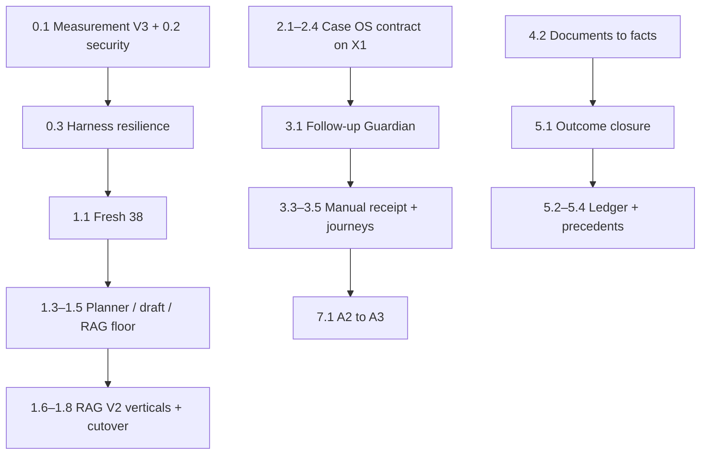

# AI-OS Roadmap — plan programu i przyszłe wdrożenia

Status: **active program plan**. Last updated: 2026-08-08 (KNOWLEDGE-SYNC-6CHAT-01).

**Rola dokumentu:** kanoniczny plan AI-OS — zamknięte fazy/slice’y, kolejność przyszłych wdrożeń, **rejestr residuali** (świadomie bounded / odłożone / do weryfikacji) oraz granice proofu. To nie jest tylko lista „następnych slice’ów”.

**Cel programu:** prowadzić sprawy do poprawnego wyniku lokalnie na zielono (`confirmed by local tests` / `PASS_LOCAL_BOUNDED` / `proven_local` tam, gdzie dotyczy runtime), bez nowego programu Repair.

**Autorytet:** plan wdrożeń + residual registry. Nie zastępuje:

- `knowledge/memory/OPERATOR_DECISIONS.md` (decyzje operatora, freeze),
- `knowledge/memory/BACKLOG.md` (pojedyncze otwarte tickety — lustrzane ID poniżej),
- kodu i runtime (SoT zachowania).

**Źródła scalenia:** `SUFITY.md`, Analiza artefaktów AI-OS, `PROGRAM_COMPLETE_LOCAL`, closeouty 2026-08-04…05, weryfikacja residual-raportów 2026-08-06 (RAG-00 / FACT / PH3 / GOV).

---

## Status taxonomy (aktywna)

Każdy aktywny slice raportuje **dwa** pola — nie używaj bare `done` bez rodzaju proofu.

```text
Delivery:
NOT_STARTED | IN_PROGRESS | PARTIAL | COMPLETE_BOUNDED | COMPLETE

Proof:
NOT_PROVEN | FOCUSED_LOCAL | CONFIRMED_LOCAL |
PASS_LOCAL_BOUNDED | PROVEN_RUNTIME
```

| Proof                                          | Znaczenie                                                                                                                          |
| ---------------------------------------------- | ---------------------------------------------------------------------------------------------------------------------------------- |
| `FOCUSED_LOCAL`                                | focused suite green; pełny Gate A nie uruchomiony albo nie wymagany                                                                |
| `CONFIRMED_LOCAL` / `CONFIRMED_BY_LOCAL_TESTS` | Gate A green na końcowym working tree                                                                                              |
| `PASS_LOCAL_BOUNDED`                           | bounded journey/API/UI green lokalnie; bez pełnego runtime E2E                                                                     |
| `PROVEN_RUNTIME`                               | bounded runtime preflight green + dedicated proof (`AIOS_RUNTIME_PROOF_REQUIRED=1`, manifest) — nie formalny pełny Gate B roadmapy |

`PROGRAM_COMPLETE_LOCAL` (Workflow Repair) pozostaje bez zmian — nie otwieraj ponownie programu Repair.

---

## Stan bazowy

| Fakt            | Znaczenie                                                              |
| --------------- | ---------------------------------------------------------------------- |
| Workflow Repair | `PROGRAM_COMPLETE_LOCAL` — układ nerwowy lokalnie domknięty            |
| Cel produktu    | Prowadzenie spraw do poprawnego wyniku (nie Capability Registry)       |
| Mapa sufitów    | Rejestr barier (`CANONICAL_POST_REPAIR_CEILING_MAP`), nie backlog 1→38 |
| Scope domyślny  | Lokalny Docker; brak VPS/prod/live send bez jawnej decyzji operatora   |

### Anti-goals (świadomie poza tym programem)

- Capability Registry, mega-broker CBM
- Live Gmail send / Calendar write „dla efektu”
- VPS / prod deploy
- Drugi dashboard obok X1
- RUN-A/B przed Measurement V3
- Trzeci orchestrator; łączenie Brain 1 + Brain 2 w jeden runtime

---

## Już zamknięte (nie otwierać bez regresji)

| ID / obszar                                            | Status                          | Uwaga                                                                                                          |
| ------------------------------------------------------ | ------------------------------- | -------------------------------------------------------------------------------------------------------------- |
| Workflowy / 78 gapów / Registry v1+v2                  | zamknięte lokalnie              | governance; `PROGRAM_COMPLETE_LOCAL`                                                                           |
| Durable kalk-top runtime, supersession (główny reader) | naprawione                      |                                                                                                                |
| SLICE-3A transport Understanding → planner             | istnieje                        |                                                                                                                |
| Canonical draft identity + Daszek `expected_body_hash` | `PASS_LOCAL`                    | Node B + Daszek stale-view; **nie otwierać** bez regresji                                                      |
| Approval ≠ send; X1 v0 / feed v3                       | istnieją                        | jakość = osobny tor                                                                                            |
| Gmail send / Calendar write                            | fail-closed                     | nie „bug”                                                                                                      |
| **1.2 Planner exec fidelity + tool budget**            | **CLOSED_LOCAL** / PASS         | `eval/planner-exec-fidelity-01/`; residual PF-01 (sanity gate coverage)                                        |
| **X1 provenance** (#2)                                 | **done** 2026-08-04             | `understanding_quality` na karcie X1                                                                           |
| **KALK_TOP_BASE_URL lokalnie** (#10 część)             | **done** 2026-08-04             | compose + doctor; runtime proof po recreate                                                                    |
| **CaseReadiness na X1** (#24 / slice 2.2)              | **COMPLETE** 2026-08-04         | jawny `CaseReadinessState` + projekcja `case_readiness`; thin `readiness_facets` zachowane jako kompatybilność |
| **Faza 3 operator journeys** (3.1–3.6)                 | **COMPLETE_BOUNDED** 2026-08-05 | bounded canonical ingress + Playwright; Gate A hermetic PASS; **nie otwierać** bez regresji                    |
| **4.1 Fact supersession audit** (#18)                  | **COMPLETE** 2026-08-05         | audit-only; fixy consumerów → 4.2+ / osobne tickety                                                            |
| **1.6 RAG V2 Technical Manual Vertical** (#15)         | **COMPLETE_BOUNDED** 2026-08-05 | shadow in-memory; produkt `RAG_CORE=legacy`                                                                    |

Częściowo pokryte wcześniej (residual w roadmapzie): lead `offer_snapshot`, PE readiness, wąski Cieplo guard. Manual send receipt + RAG abstain floor — domknięte w 3.3 / 1.5.

---

## Zasady wykonania slice'a

1. **Bounded run** — jeden slice = jeden task `ai_os_task`, scope `repo:path`, `LOCAL_ONLY` domyślnie.
2. **Gate A** per dotknięte repo przed commitem.
3. **Gate B** tylko gdy Docker/runtime/bridge — nie dla docs-only.
4. **Freshness** GitNexus/CBM przed edycją high-risk kontraktów.
5. **Status proof:** używaj taksonomii powyżej; nigdy bare `done` bez Delivery + Proof.

---

## Faza 0 — Fundament pomiaru i środowiska

_Bez tego fresh 38 i journey nie są wiarygodne._

| Kolejność | Slice                                     | Repo / obszar            | Done when                                                                    | Delivery / Proof                                                          |
| --------- | ----------------------------------------- | ------------------------ | ---------------------------------------------------------------------------- | ------------------------------------------------------------------------- |
| 0.1       | **Measurement Integrity V3** (offline)    | eval harness / knowledge | qualification contract, manifest, `JUDGE_ERROR→HARNESS`, measurement≠product | **COMPLETE** / `CONFIRMED_LOCAL` — `docs/MEASUREMENT_INTEGRITY_V3.md`     |
| 0.2       | **Security closeout** (klucze / exposure) | workspace / env          | brak markerów exposure w tracked files; klucze poza gitem                    | **COMPLETE** / `CONFIRMED_LOCAL` — `scripts/security_closeout_audit.py`   |
| 0.3       | **Harness resilience**                    | gmail-agent eval         | jeden case nie zabija całego runu; CAPACITY/HARNESS/DELIVERY jawne           | **COMPLETE** / `CONFIRMED_LOCAL` — `eval_capability_batch_harness.py`     |
| 0.4       | **KALK_TOP runtime proof**                | gmail-agent + kalk-top   | recreate Node B; health `:8091`; jedno wywołanie tool path lub doctor green  | **COMPLETE_BOUNDED** / script — `scripts/phase0_kalk_top_local_proof.ps1` |

---

## Faza 1 — Baseline inteligencji

_Nie gonić 34/38; v2 primary scoring._

| Kolejność | Slice                                         | Sufit # | Done when                                         | Delivery / Proof                                                                                                                                              |
| --------- | --------------------------------------------- | ------- | ------------------------------------------------- | ------------------------------------------------------------------------------------------------------------------------------------------------------------- |
| 1.1       | **Fresh 38 post-Repair**                      | #12     | `scoring_complete:true`, v2 rubric, artefakt runu | **COMPLETE** / measurement 2026-08-04 — `eval/phase1-fresh38-merged-v2/`                                                                                      |
| 1.2       | **Tool availability + tool-budget integrity** | #17     | budżety egzekwowane; brak cichego discard         | **COMPLETE** / product 2026-08-04 — `eval/planner-exec-fidelity-01/`                                                                                          |
| 1.3       | **Planner quality na pełnym Understanding**   | #13     | po 1.1; regresja na dominujących wymiarach        | **COMPLETE_BOUNDED** / `CONFIRMED_LOCAL` — Gate A 2095; `NEXT_STEP_QUALITY_13.md`                                                                             |
| 1.4       | **Jakość draftów — treść**                    | #14     | po identity (done) i 1.1                          | **COMPLETE** / `CONFIRMED_BY_LOCAL_TESTS` — wspólny sanity floor Brain1+Model A; future-tense; końcowy Gate A na working tree z 1.4+2.x green (`2181 passed`) |
| 1.5       | **RAG / company knowledge floor**             | #15     | evidence/abstain; bez raw fragment dump           | **COMPLETE_BOUNDED** / `PASS_LOCAL_BOUNDED` — patrz niżej                                                                                                     |
| 1.6       | **RAG V2 Technical Manual Vertical**          | #15     | pierwsza realna instrukcja na V2 data plane       | **COMPLETE_BOUNDED** / `PASS_LOCAL_BOUNDED` — patrz niżej                                                                                                     |
| 1.7       | **RAG V2 Price List / Exact Facts Vertical**  | #15     | tabele, kody, netto/brutto, supersession          | **COMPLETE_BOUNDED** / `FOCUSED_LOCAL` — shadow vertical `rag-chat-asystent:04619fe`; brak live cennik PDF                                                    |
| 1.8       | **RAG V2 Shadow Dual-Read and Cutover Gate**  | #15     | legacy vs V2 compare; staged cutover              | **COMPLETE_BOUNDED** / `FOCUSED_LOCAL` — dual-read + cutover scaffolding `rag-chat-asystent:abe3fd3`; produkt `RAG_CORE=legacy`                               |

### Slice 1.5 — zapis finalny

```text
Delivery: COMPLETE_BOUNDED
Proof: PASS_LOCAL_BOUNDED
Zakres: abstain/evidence safety floor, no raw fragment dump,
RAG_CORE strangler seam, domenowy scaffold i fail-closed facade.
```

**Co jest w 1.5:** legacy floor (`llm_unavailable` / `generation_failed` → controlled abstain); `RAG_CORE=legacy` default; nieaktywny V2 fail-closed (`rag_v2_not_activated`); domain scaffold pod `backend/rag_v2/` (kontrakty + adapter stubs + facade). **To nie jest kompletny data plane RAG V2.**

**Deferred (kolejne slice’y 1.6–1.8 — nie „brak w 1.5”):**

- Docling;
- DocumentGraphV1 (wdrożenie ingestu, nie sam kontrakt);
- PostgreSQL / MinIO;
- Temporal;
- Qdrant;
- technical-manual vertical;
- shadow dual-read;
- cutover.

**Integration:** 11× `ScopeMismatch` (pytest-base-url) — `PRE_EXISTING_CONFIRMED` na czystym HEAD; naprawione fixture graph w 1.5 closeout (session-scoped `base_url`). Pełny suite non-integration green; integration bez setup errors (skip bez `RUN_INTEGRATION`).

### Slice 1.6 — Technical Manual Vertical

```text
Delivery: COMPLETE_BOUNDED
Proof: PASS_LOCAL_BOUNDED
```

**Co jest w 1.6 (shadow, bez cutover produktu):** jedna fixture instrukcja techniczna
(pompa ciepła) → trwały oryginał w `InMemoryBlobStoreV2` → page-marker ingest
(`DocumentGraphV1`; Docling soft-capability) → structural quality gate → hierarchical
parent-child chunks → in-memory dense+sparse index → `EvidencePack` z dokładną stroną →
shadow answer (`affects_legacy=false`) + gold set (3). Produkt nadal `RAG_CORE=legacy`;
`RAG_CORE=v2` pozostaje fail-closed abstain na `/chat`.

**Pliki:** `rag-chat-asystent/backend/rag_v2/verticals/technical_manual/`,
`adapters/memory.py`, `tests/test_rag_v2_technical_manual_vertical.py`.

**Deferred do 1.7/1.8:** live MinIO/Temporal/Qdrant/Docling production, price-list cells,
shadow dual-read vs legacy, staged cutover.

**Proof (2026-08-05):** Gate A `rag-chat-asystent` **601 passed, 17 skipped, 0 failed**;
commit lokalny `rag-chat-asystent:ebd3316` na `feature/aios-roadmap-1.4-2.4`.
**Nie twierdzę:** live MinIO/Qdrant/Docling, cutover 1.8, price-list 1.7, live LLM quality.

### Slice 1.7 — Price List / Exact Facts Vertical

**Delivery:** `COMPLETE_BOUNDED`. **Proof:** `FOCUSED_LOCAL` (Gate A rag **677 passed, 22 skipped** post-closure).

Commit `rag-chat-asystent:04619fe`. Shadow/in-memory vertical z gold tests; **nie twierdzę:** live row/cell proof na realnym cenniku PDF, netto/brutto validity na produkcji.

Done when:

- pełne tabele i komórki w DocumentGraph;
- exact product codes;
- netto/brutto;
- version validity;
- strukturalny lookup (nie sam BM25);
- dowód wiersza/komórki w Evidence Pack;
- supersession między wersjami cennika.

### Slice 1.8 — Shadow Dual-Read and Cutover Gate

**Delivery:** `COMPLETE_BOUNDED`. **Proof:** `FOCUSED_LOCAL`.

Commit `rag-chat-asystent:abe3fd3`. Dual-read harness + cutover gate + opt-in activation (RAG-09 bounded); **nie twierdzę:** product cutover, `live_data_plane=true`, pełny rollback na żywym stacku.

Done when:

- legacy vs V2 comparison harness;
- quality metrics (grounding, abstain honesty);
- sensitivity proof;
- staged generation activation;
- wybrane intenty przełączane jawnie (`RAG_CORE` / intent gate);
- brak big-bang cutover.

---

## Faza 2 — Kontrakt operacyjny sprawy

_Prerequisite produktu Case OS na karcie X1._

| Kolejność | Slice                             | Sufit # | Done when                                                      | Delivery / Proof                                                                                                  |
| --------- | --------------------------------- | ------- | -------------------------------------------------------------- | ----------------------------------------------------------------------------------------------------------------- |
| 2.1       | **Stagnation SoT**                | #5      | jeden kontrakt: oczekiwanie vs zastój (nie „brak maila N dni”) | **COMPLETE** / `CONFIRMED_BY_LOCAL_TESTS` — `stagnation_sot.py`; Gate A full green                                |
| 2.2       | **CaseReadiness jako jawny stan** | #24     | pełniejszy stan niż thin `readiness_facets`; przed membership  | **COMPLETE** / `CONFIRMED_BY_LOCAL_TESTS` — `CaseReadinessState` + `case_readiness`; thin facets = kompatybilność |
| 2.3       | **SLICE-2C**                      | #4      | Understanding status ≠ `feed_visibility`                       | **COMPLETE** / `CONFIRMED_BY_LOCAL_TESTS` — `case_understanding_status`; izolacja od membership                   |
| 2.4       | **X1 exceptions-only**            | #3      | membership, szum, reclassify, `why_you`, `case_timeline_only`  | **COMPLETE_BOUNDED** / `PASS_LOCAL_BOUNDED` — patrz niżej                                                         |

### Slice 2.4 — zapis finalny

```text
Delivery: COMPLETE_BOUNDED
Proof: PASS_LOCAL_BOUNDED
```

Zakres wdrożony lokalnie (bez Gate B / browser E2E):

| Podzakres | Zawartość                                                               | Status |
| --------- | ----------------------------------------------------------------------- | ------ |
| 2.4A      | membership + `why_you` / reason codes + `case_timeline_only` consumer   | w 2.4  |
| 2.4B      | soft reorder + `exceptions_only` API (`GET /system/operational-feed`)   | w 2.4  |
| 2.4C      | operator override endpoint (`POST …/feed-visibility/override`)          | w 2.4  |
| 2.4D      | Daszek reclassify UI + toggle „Tylko wyjątki”                           | w 2.4  |
| 2.4E      | contract hardening: requested vs effective visibility + clear semantics | w 2.4  |

**Kontrakt override (2.4E):**

- **Request modes** (decyzja operatora / zapis w SoT): `hidden` \| `case_timeline_only` \| `main_feed`
- **Effective modes** (projekcja read-time): m.in. `attention_required` gdy executive work outstanding — **nie** jest legalnym `mode` w requeście
- Odpowiedź rozdziela jawne pola: `requested_override_mode`, `stored_feed_visibility_mode`, `effective_feed_visibility_mode`; `feed_visibility_mode` = alias kompatybilności do effective
- `clear=true`: `mode` musi być absent/null; `clear=true` + `mode` → **400 `ambiguous_request`** (fail-closed)
- Daszek: kanoniczny body (`buildFeedVisibilityOverrideRequestBody`), clear bez fikcyjnego `mode`, UI pokazuje effective ≠ requested override

**Proof:** focused 2.1–2.4 `72 passed`; API 2.4 `15 passed`; pełny Gate A gmail-agent `2181 passed, 10 skipped`; daszek `node --check` + `php -l` OK. Commity lokalne na `feature/aios-roadmap-1.4-2.4`: `gmail-agent` `b4c348b`, `daszek` `8dab0cb`. **Nie** `PROVEN_RUNTIME` — brak Gate B / Playwright E2E override.

**Zależność:** 2.1 przed Follow-up Guardian (Faza 3). SLICE-2C niezależny od provenance (done).

---

## Faza 3 — Akcje operatorskie (proponuje, nie wysyła)

| Kolejność | Slice                                        | Sufit #             | Done when                                        | Delivery / Proof                                                                                |
| --------- | -------------------------------------------- | ------------------- | ------------------------------------------------ | ----------------------------------------------------------------------------------------------- |
| 3.1       | **Follow-up Guardian**                       | #6                  | po 2.1; Case → temporal signal → propozycja → X1 | **COMPLETE_BOUNDED** / `CONFIRMED_LOCAL` — patrz niżej                                          |
| 3.2       | **Draft lineage residual**                   | Analiza B1          | Brain 2 przenosi; nie generuje drugiego draftu   | **COMPLETE** / `CONFIRMED_LOCAL` — patrz niżej                                                  |
| 3.3       | **Manual send receipt E2E**                  | Analiza / #25 część | Sent intake → `communication_sent`               | **COMPLETE_BOUNDED** / `CONFIRMED_LOCAL` — patrz niżej                                          |
| 3.4       | **Jeden customer-email journey do approval** | —                   | bounded E2E bez live send                        | **COMPLETE_BOUNDED** / `PASS_LOCAL_BOUNDED` — patrz niżej                                       |
| 3.5       | **Pełny journey mail→Daszek→approval**       | #7                  | po 3.4                                           | **COMPLETE_BOUNDED** / Playwright `PROVEN_RUNTIME` (canonical ingress; no live send)            |
| 3.6       | **Journey serwis/reklamacje**                | #8                  | po wzorcu #7                                     | **COMPLETE_BOUNDED** / complaint+noise `PROVEN_RUNTIME` (canonical ingress; Playwright approve) |

### Slice 3.1 — zapis finalny

```text
Delivery: COMPLETE_BOUNDED
Proof: CONFIRMED_LOCAL
```

Zamyka Journey D z `SUFITY.md` (Barrier Matrix): "cisza N dni → propozycja" nie istniało w kodzie
w ogóle (`sla_watcher` starzeje tylko już-istniejące decyzje; `_pending_outcome_gaps_pl` odpala
tylko przy nowym mailu). `gmail-agent/tools/gmail_audit/follow_up_guardian.py` (nowy moduł)
domyka pętlę, **reużywając** trzy już potwierdzone prymitywy bez zmiany ich logiki:

- `stagnation_sot.evaluate_waiting_vs_stagnation` (2.1) — jedyny SoT dla waiting-vs-stagnating;
- `feed_visibility._has_pending_operator_work` (2.4) — już promuje snapshot z `actions[].enabled`
  do `attention_required` na X1; guardian tylko dopisuje taki `ActionItem`, zero zmian widoczności;
- wzorzec read → `apply_snapshot_delta` → `save_snapshot(expected_version=...)` (CAS) już używany
  przez `mcp_service.approve_hitl_action`.

Nowy periodyczny tick (`signal_worker._maybe_run_follow_up_guardian_tick`, ten sam throttle co
`_maybe_run_sla_watcher_tick`) skanuje ostatnie snapshoty (`store.list_recent_snapshots_with_updated_at`
— nowa, addytywna metoda ABC+InMemory+Postgres), liczy `hours_in_state` z `updated_at` wiersza
(jedyny realny proxy — `lifecycle_state_since` nigdzie w repo nie jest zapisywane), i przy
`status=stagnating` dopisuje jeden deduplikowany `ActionItem` (`id=follow_up_guardian`).

**Świadoma granica zakresu:** `OperationalStatus.code` ma tylko 5 wartości Literal, a
`OPERATIONAL_TO_LIFECYCLE` mapuje z nich dokładnie 3 na stan z budżetem `SLA_HOURS`
(`new_lead`, `qualification`, `offer_preparation`) — guardian widzi stagnację tylko w tych 3
stanach; nie widzi `waiting_for_client`/`negotiation`/itd., bo snapshot dziś nie niesie bogatszego
stanu lifecycle. Brak też joina do `case_status` (closed/merged) na poziomie snapshotu — case
zamknięty teoretycznie mógłby dalej wyglądać na stagnujący; nie naprawiane w tym slice (osobny
backlog item, nie blocker tego zakresu).

**Proof:** nowy `tools/gmail_audit/tests/test_aios_3_1_follow_up_guardian.py` (11/11); pełny Gate A
gmail-agent `2192 passed, 10 skipped, 24 subtests` (było 2181 przed 3.1). Commit lokalny na
`feature/aios-roadmap-1.4-2.4`: `gmail-agent:9bb2ce1d`. **Nie** `PROVEN_RUNTIME` — nowa
`PostgresOperatorEngagementStore.list_recent_snapshots_with_updated_at` sprawdzona tylko przez
`InMemoryOperatorEngagementStore` w testach; brak Gate B / dowodu, że tick faktycznie odpala się w
żywym workerze na realnym Postgresie.

### Slice 3.2 — zapis finalny

```text
Delivery: COMPLETE
Proof: CONFIRMED_LOCAL
```

Brain 1 (`reply_drafter`) → `upstream_draft_transport` w `agent_signal` → intercept
`generate_draft_reply` w `AgentGraphEngine` → `resolve_generate_draft_reply` (transfer bez
handlera). Fallback: brak upstream → `generate_draft_reply` bez zmiany identity contract.

**Trwałe provenance (korekta 2026-08-05):** `draft_lineage_provenance` na
`EngagementSnapshotV2` (`draft_origin`, `origin_correlation_id`, `origin_producer`,
`origin_created_at`); `communication_receipt.draft_origin` po approve. Brain1 → `brain1`;
fallback → `brain2_fallback`; legacy bez metadata → `legacy_unknown`. Bez zmiany frozen
`ActionItem` schema.

**Pliki:** `agent_runtime/draft_lineage_transport.py`, `draft_lineage_provenance.py`; zmiany w
`agent_reconcile.py`, `graph.py`, `handlers.py`, `mcp_service.py`, `outbound_receipt.py`,
`llm_contracts/engagement_snapshot_v2.py`. **Proof:** `tests/test_aios_3_2_draft_lineage_residual.py`
(17/17).

### Slice 3.3 — zapis finalny

```text
Delivery: COMPLETE_BOUNDED
Proof: PASS_LOCAL_BOUNDED
```

Outbound SENT przez kanoniczny `MailboxMemoryRuntime.ingest_message` → `infer_live_direction` →
`try_apply_communication_sent_receipt` (patch `build_operator_engagement_store` w teście).
Asercje: event `communication_sent`, snapshot `communication_sent`, idempotency eventów, brak
Gmail API send.

**Proof:** `tests/test_aios_3_3_manual_send_receipt_e2e.py` (4/4).

### Slice 3.4 — zapis finalny

```text
Delivery: COMPLETE_BOUNDED
Proof: PASS_LOCAL_BOUNDED
```

Fixture `post_offer_question`: ingest → Case + registry → understanding trace → Brain1 transport →
HITL approve → `ready_for_manual_send` (bez `communication_sent`).

**Proof:** `tests/test_aios_3_4_customer_email_journey_approval.py` (2/2).

### Slice 3.5 — zapis finalny

```text
Delivery: COMPLETE_BOUNDED
Proof: PROVEN_RUNTIME (Playwright + canonical ingress; 2026-08-05)
```

**Before (usunięte z proofu):** Playwright + bezpośredni `PostgresOperatorEngagementStore.insert_snapshot`
(fixture `post_offer_question`) + `approve_hitl_action` in-process — dowodziło tylko
backend state → projekcja → approval, bez kanonicznego mail ingress.

**After (canonical ingress):** fixture `post_offer_question` → `run_gmail_signal_runtime`
(`aios_canonical_runtime_ingress.py`) → reconcile/agent → Case/HITL/draft w Postgres →
feed push (z `DASZEK_LOGIN` z `.env.playwright.local`) → Playwright login + dismiss onboarding +
`[data-hitl-approve]` w Daszek → Node B `/engagements/.../hitl/approve` → `ready_for_manual_send`
(bez live send).

Manifest pola: `seed_method=canonical_runtime_ingress`, `direct_database_seed_used=false`,
`ingress_receipt_id`, `case_id`, `draft_id`, `hitl_id`.

**Proof:** dedicated run `AIOS_RUNTIME_PROOF_REQUIRED=1` → **5 passed** (3.5 + 3.6 + noise);
manifest finalnego checkpointu: `artifacts/phase3-runtime-proof/20260805T090729Z/proof-manifest.json`
(wcześniejszy run tego dnia: `20260805T074235Z`).
Wymaga aktualnego obrazu Node B (`docker compose build` + recreate) — stary kontener padał na
`EngagementSnapshotV2` ValidationError (`draft_lineage_provenance` / receipt).

### Slice 3.6 — zapis finalny

```text
Delivery: COMPLETE_BOUNDED
Proof: PROVEN_RUNTIME (complaint Playwright + noise ingress; 2026-08-05)
```

Complaint: semantyczny fixture reklamacyjny → ten sam canonical ingress co 3.5
(`run_canonical_runtime_ingress_from_snapshot`) → feed push → Daszek HITL approve.
Noise: `run_canonical_runtime_noise_ingress` (ten sam entrypoint, `lane=skip`, brak Case/HITL/X1).

**Proof:** ten sam dedicated run + manifest journeys `3.6_complaint`, `3.6_noise_control`.

### Faza 3 — proof zbiorczy (3.2–3.6)

```text
Faza 3:
Delivery: COMPLETE_BOUNDED
Proof: PROVEN_RUNTIME
Full Gate A: PASS
Live Gmail send: NOT INCLUDED / FROZEN
Intelligence during journey proof: deterministic test double
```

Canonical ingress + Playwright approve (bez live Gmail send): **PASS** dla 3.5/3.6.
Uwaga honesty: ingress nadal mockuje mailbox-intelligence downstream / planner w harnessie
(nie pełny live LLM Understanding) — to jest **bounded** proof, nie unlimited production fidelity.

**Full Gate A gmail-agent (finalny checkpoint Fazy 3, 2026-08-05):**
**2241 passed, 12 skipped, 0 failed** (`confirmed by local tests`; wymóg było ≥2235).
Playwright journeys w Gate A **skip** bez `AIOS_RUNTIME_PROOF_REQUIRED=1`.
Produkcyjne moduły **nie** rozgałęziają się na `PYTEST_CURRENT_TEST` — hermetyzacja wyłącznie
przez jawne env + fixture/marker (`GMAIL_AUDIT_SKIP_AGENT_DOTENV`, `GMAIL_AUDIT_DISABLE_LLM_CACHE`,
`@pytest.mark.agent_runtime` / `llm_cache` / `live_llm_env`; KALK_TOP strip w conftest).

**Dedicated runtime proof** (`AIOS_RUNTIME_PROOF_REQUIRED=1`): **5 passed, 0 skipped** po
rebuild `gmail-agent-nodeb-api` + `.env.playwright.local`.
Manifest przykładowy: `artifacts/phase3-runtime-proof/20260805T090729Z/proof-manifest.json`
(`manifest_schema_version=1`) z provenance:

- `git_head_sha`, `node_b_image_id` / `node_b_image_created_at`
- `working_tree_dirty` (= pełny `git status --porcelain`) oraz jawne
  `tracked_working_tree_dirty` / `untracked_paths_present` / `untracked_paths_count`
- `pytest_result`, `gate_a_result`
- `intelligence_mode=deterministic_test_double`, `runtime_wiring_mode=production_runtime_wiring`
- `live_gmail_send_enabled=false`

**Governance residuale (domknięte w tym samym dniu):** sanitized
`.env.playwright.local.example` wersjonowany; semantyka dirtiness rozdzielona tracked/untracked.

**Commity lokalne (LOCAL_ONLY, Faza 3 closeout):** m.in. `gmail-agent:2480e895` (hermetic journeys),
`gmail-agent:ac7e8fc` (dirtiness + env example), `knowledge` roadmap closeout.
**Fazy 3 nie otwierać ponownie** bez konkretnej regresji.

**Poza zakresem proofu (jawnie):** Live Gmail delivery = `NOT_INCLUDED` / FROZEN;
Live LLM quality podczas journey = `NOT_PROVEN`.

---

## Faza 4 — Fakty, dokumenty, install-prep

| Kolejność | Slice                                  | Sufit # | Done when                          | Delivery / Proof                                                                                                                                                                           |
| --------- | -------------------------------------- | ------- | ---------------------------------- | ------------------------------------------------------------------------------------------------------------------------------------------------------------------------------------------ |
| 4.1       | **Audit consumerów fact supersession** | #18     | wszyscy konsumenci zidentyfikowani | **COMPLETE** / `FOCUSED_LOCAL` — patrz niżej                                                                                                                                               |
| 4.2       | **Documents→facts**                    | #19     | cytat, konflikt, UI operatorski    | **COMPLETE_BOUNDED** / `PROVEN_LOCAL` — backend `0ffef08` + Daszek UI whitelist/`superseded_facts` + live Drive ingest (`processed_count=5`) + pack projection; pełny RAG-12 poza zakresem |
| 4.3       | **PDF readiness honesty**              | #20     | `PDF_READY` ≠ „coś powstało”       | **COMPLETE_BOUNDED** / `CONFIRMED_LOCAL` — `cieplo:49c8ef1` + `gmail-agent:b2f071d` (`test_aios_4_3*`); Gate A 2322/14                                                                     |
| 4.4       | **Install-prep**                       | #9      | projekcja Case, nie drugi SoT      | **REJECTED_BY_OPERATOR** / `NO PRODUCT ACTIVATION` — scaffold z WAVE-01 może istnieć w kodzie; **nie** rozwijać ani aktywować produktowo (decyzja 2026-08-08)                              |

**Zależność historyczna:** 4.1 → 4.2. Slice **4.4 jest odrzucony przez operatora** (scaffold
bez product activation) — nie planować go jako next.

### Slice 4.1 — zapis finalny

```text
Delivery: COMPLETE
Proof: FOCUSED_LOCAL
```

Pełny inventory consumerów `mailbox_memory_facts` względem supersession (RP-29 / DQ-10):
`knowledge/docs/AIOS_4_1_FACT_SUPERSESSION_CONSUMER_AUDIT.md` (enrichment explore tego samego dnia).

Kluczowe ustalenia:

- `fetch_facts_for_case` zwraca historię (active+superseded); filtrowanie = obowiązek consumera;
- bezpieczna ścieżka: `split_conflicting_facts` / `CaseContextPack.active_facts`
  (jedyny kanoniczny live-fact filter);
- **Hub inconsistency:** `build_case_context_pack` nadal przekazuje **raw** `facts` do
  `build_current_case_context_snapshot` / `build_case_snapshot` — pack `active_facts` safe,
  embedded snapshot `key_facts` może nie być;
- **Postgres vs InMemory parity:** `InMemoryMailboxMemoryStore.append_fact_rows` **nie**
  robi supersession (Postgres deleguje do `append_facts_with_supersession`) — HIGH.

**Luki HIGH (audit-only; fix poza 4.1):** m.in. `build_case_snapshot` / hot-state /
`ingest_message`/`finalize_case`, `entity_linker`, `handlers._fetch_invoice_fields`,
`neo4j_pilot`, Drive `first_fact_value` / projection refresh, `similar_cases_precedent._active_fact_keys`
(nie filtruje `superseded`), InMemory `append_fact_rows`.
**MEDIUM–HIGH if leaked:** `normalize_facts` mapuje `superseded` → `inferred`.

**Nie twierdzę:** consumer fixes, Documents→facts (4.2), Gate B.

---

### Slice 4.2 — residual closeout (UI + live Drive)

```text
Delivery: COMPLETE_BOUNDED
Proof: PROVEN_LOCAL (Drive ingest) + CONFIRMED_BY_LOCAL_TESTS (UI/whitelist/hermetic)
```

- Daszek: `superseded_facts` whitelisted in `store-v2-domain.php` / `store-v2-read.php`;
  `renderMailboxSupersededItems` in `public/app.js`; fixture `fixtures/v3/conflicts.json`.
- Live Drive: `gmail_intake.py drive-ingest --limit 5` → `processed_count=5`,
  `stored_document_count=5` (scratch `C:\top-code-session-scratch\drive-4-2-live-e2e\`).
- Live mailbox DB currently has **0** superseded fact rows; pack still exposes
  `superseded_facts: []` key. Hermetic 4.2 tests cover non-empty superseded audit.

**Nie twierdzę:** pełny Gate B stack; human visual PW screenshot as sole proof.

---

### Slice 4.4 — Install-prep projection

```text
Delivery: REJECTED_BY_OPERATOR
Proof: NO PRODUCT ACTIVATION
Code: scaffold may remain from RESIDUALS-WAVE-01 (do not develop / do not auto-revert)
```

- Owner (historical scaffold): `gmail-agent/tools/gmail_audit/install_prep_projection.py`
- Feed / Daszek whitelist may still exist — **not** a planned product feature.
- Operator decision 2026-08-08: rezygnacja z Install-prep jako produktu (`OPERATOR_DECISIONS.md`).

**Nie twierdzę:** product readiness, operator UI card, HVAC SoT change.

---

## Faza 5 — Zamknięcie biznesowe i uczenie

| Kolejność | Slice                           | Sufit # | Done when              | Delivery / Proof                                                                                    |
| --------- | ------------------------------- | ------- | ---------------------- | --------------------------------------------------------------------------------------------------- |
| 5.1       | **Business outcome closure**    | #21     | won ≠ completed ≠ sent | **COMPLETE_BOUNDED** / `CONFIRMED_LOCAL` — `gmail-agent:b2f071d` + `daszek:8929945`; Gate A 2322/14 |
| 5.2       | **Correction Ledger**           | #22     | append-only korekty    | **COMPLETE_BOUNDED** / `CONFIRMED_LOCAL` — `gmail-agent:b2f071d` + Daszek trail; Gate A 2322/14     |
| 5.3       | **Precedensy z outcome**        | #16     | po 5.1                 |
| 5.4       | **Approved rules → zachowanie** | #23     | po ledger + outcome    |

---

## Faza 6 — Agent Chat i integracje pomocnicze

Phase 6 slices **nie** mają osobnych numerów w historycznym rejestrze sufitów (`SUFITY.md` / ceiling map) —
to spine wykonawczy Agent Chat / OperatorCommand powstały po baseline. Sufity #21–#23 pokrywają outcome/ledger
(Faza 5); 6.1–6.3 są świadomie poza kolumną „Sufit #”.

| Kolejność | Slice                                | Done when                                         | Delivery / Proof                                                                                                               |
| --------- | ------------------------------------ | ------------------------------------------------- | ------------------------------------------------------------------------------------------------------------------------------ |
| 6.1       | **Agent Chat: instruction envelope** | `user_instruction` poza system prompt             | **COMPLETE_BOUNDED** / `CONFIRMED_LOCAL` — `gmail-agent:b2f071d`; Gate A 2322/14                                               |
| 6.2       | **Async Agent Chat**                 | POST 202 + worker + journal                       | **COMPLETE_BOUNDED** / `PROVEN_RUNTIME` + `CONFIRMED_LOCAL` — E2E 6/6; `workspace:1c5137e` tracked; Gate A 2322/14 @ `b2f071d` |
| 6.3       | **Command spine**                    | OperatorCommand → journal → receipt               | **COMPLETE_BOUNDED** / `CONFIRMED_LOCAL` — `operator_command_spine` @ `b2f071d`; Gate A 2322/14                                |
| 6.4       | **Lead / offer_snapshot**            | OfferDTO → readiness, nie pełny Case od razu      | **NOT_STARTED** / `NOT_PROVEN`                                                                                                 |
| 6.5       | **Cieplo resumable retry**           | `DONE_DEGRADED`, jawny handoff; live proof osobno | **NOT_STARTED** / `NOT_PROVEN`                                                                                                 |

---

## Faza 7 — Autonomia (późno; część zamrożona)

| Kolejność | Slice                                | Sufit # | Uwaga                                     |
| --------- | ------------------------------------ | ------- | ----------------------------------------- |
| 7.1       | **A2→A3**                            | #25     | approval → intent → side effect → receipt |
| 7.2       | **Live Gmail send**                  | #26     | zamrożone — decyzja operatora             |
| 7.3       | **Calendar write + visit lifecycle** | #27     | zamrożone read-only                       |
| 7.4       | **Cieplo live**                      | #28     | osobny proof                              |
| 7.5       | **RP-12 replay / recovery**          | #29     | governance-deferred                       |

**Zależność:** identity + receipts (3.2, 3.3) → 7.1.

---

## Faza 8 — External (nie „następny sufit Case OS”)

| Kolejność | Slice                                      |
| --------- | ------------------------------------------ |
| 8.1       | UX kalkulator / fast-kalk / generator 2027 |
| 8.2       | `topinstal.com.pl` → Case OS intake        |
| 8.3       | Oferta PDF jako produkt customer-facing    |

---

## Ciągłe — assurance agentów (#33–38)

Nie sekwencja delivery; obowiązkowe przed większymi slice'ami:

- freshness GitNexus/CBM dla dotkniętych repo
- cross-repo routing i SoT boundaries
- concurrent dirty ownership (`ai_os_task`)
- portable harness / reproducible proof
- jawny język statusów (taksonomia powyżej)

---

## Ścieżka krytyczna



Dwa równoległe tory produktowe + tor safety po 4.1:

```text
P0 safety:               FACT-01…05 (supersession consumers / hub)
Case OS product path:    4.2 Documents→facts  (po lub z FACT hub)
RAG critical path:       1.7 Price List / Exact Facts → 1.8 dual-read/cutover
Intelligence path:       IQ-01 Understanding→Decision quality
```

---

## Zależności (nie łamać)

```text
stale-view ✓  →  X1 provenance ✓  ↛  membership (osobny tor)
SLICE-2C niezależny od provenance
Stagnation SoT ✓  →  Follow-up Guardian ✓  →  Faza 3 journeys ✓
harness resilience  →  fresh 38  →  planner / draft / RAG floor ✓
RAG floor (1.5) ✓  →  1.6 technical manual ✓  →  1.7 price list  →  1.8 dual-read/cutover
4.1 supersession audit ✓  →  4.2 Documents→facts  →  install-prep
outcome closure  →  precedensy / learning
Correction Ledger  →  adaptive rules
identity + receipts ✓  →  A3 / live send (zamrożone)
```

---

## Rejestr residuali i przyszłych wdrożeń

Weryfikacja mechaniczna 2026-08-06 względem kodu, commitów i artefaktów. Elementy później naprawione **nie** wracają do „open”.

### Werdykty weryfikacji (dziś)

| ID                                 | Claim z raportu                                  | Werdykt                           | Dowód                                                                                                                                                                                                                                                                      |
| ---------------------------------- | ------------------------------------------------ | --------------------------------- | -------------------------------------------------------------------------------------------------------------------------------------------------------------------------------------------------------------------------------------------------------------------------- |
| **RAG-00**                         | konflikt `1.6 NOT_STARTED` vs `COMPLETE_BOUNDED` | **RESOLVED → COMPLETE_BOUNDED**   | commit `rag-chat-asystent:ebd3316` zawiera `adapters/memory.py`, vertical `technical_manual/` (fixture, ingest, quality_gate, chunking, retrieve, shadow, gold_set=3), test `test_rag_v2_technical_manual_vertical.py`. Starszy audit „NOT_STARTED” = przed implementacją. |
| **GOV-01**                         | `working_tree_dirty` vs untracked                | **FIXED_CODE**                    | `gmail-agent:ac7e8fc` — `_working_tree_dirtiness()` + pola `tracked_*` / `untracked_*`. Manifest `20260805T090729Z` jest **sprzed** tego commita (SHA `bdf0e7c`) — brak pól w starym JSON to lag artefaktu, nie brak fixu.                                                 |
| **GOV-03**                         | `.env.playwright.local.example` untracked        | **FIXED**                         | plik tracked w `gmail-agent` (sanitized placeholders).                                                                                                                                                                                                                     |
| **GOV-04/05**                      | stale ACTIVE/LAST_SESSION                        | **FIXED this session**            | zsynchronizowane z roadmapą (next = FACT/4.2/1.7/IQ-01).                                                                                                                                                                                                                   |
| **PH3-06**                         | trace/screenshot w Playwright                    | **CLOSED_LOCAL**                  | harness `gmail-agent:d2ce80d`; `PHASE3_RUNTIME_PROOF_SUMMARY.json` tracked `knowledge:e916ff6`; live re-proof na final SHA opcjonalny                                                                                                                                      |
| **1.2 planner fidelity**           | CLOSED_LOCAL                                     | **CONFIRMED**                     | `knowledge/eval/planner-exec-fidelity-01/` (EXECUTIVE_SUMMARY PASS). Residual PF-01 → **COMPLETE_BOUNDED** `gmail-agent:c6fda99` (brak exhaustive inventory).                                                                                                              |
| Draft identity + Daszek stale-view | `PASS_LOCAL`                                     | **CONFIRMED** (już w zamkniętych) | nie otwierać bez regresji.                                                                                                                                                                                                                                                 |

---

### P0 — Fact supersession (implementacja po audycie 4.1)

Audit `COMPLETE` / `FOCUSED_LOCAL` ≠ naprawiony kod. SoT: `AIOS_4_1_FACT_SUPERSESSION_CONSUMER_AUDIT.md` (`knowledge:b8ac487`).

**Closure audit 2026-08-06:** Gate A gmail-agent **2314 passed, 14 skipped**. Commity `gmail-agent:b2bd4d4` (FACT-01…05 + `active_facts`).

| ID                             | Zadanie                                                   | Status closure (Delivery / Proof)                                                                                                                                                                                                  |
| ------------------------------ | --------------------------------------------------------- | ---------------------------------------------------------------------------------------------------------------------------------------------------------------------------------------------------------------------------------- |
| **FACT-01**                    | Snapshot / hot-state readers respektują supersession      | **COMPLETE_BOUNDED** / `CONFIRMED_BY_LOCAL_TESTS` — focused tests green; live Neo4j nie re-proven                                                                                                                                  |
| **FACT-02**                    | Neo4j graph projection / readers                          | **COMPLETE_BOUNDED** / `CONFIRMED_BY_LOCAL_TESTS` — unit/mocked Neo4j                                                                                                                                                              |
| **FACT-03**                    | Parity `append_fact_rows` Postgres ↔ InMemory             | **COMPLETE_BOUNDED** / `CONFIRMED_BY_LOCAL_TESTS` — parity 8 tests                                                                                                                                                                 |
| **FACT-04**                    | `normalize_facts` nie mapuje `superseded→inferred`        | **COMPLETE_BOUNDED** / `CONFIRMED_BY_LOCAL_TESTS`                                                                                                                                                                                  |
| **FACT-05**                    | Hub `build_case_context_pack` consistency                 | **COMPLETE_BOUNDED** / `CONFIRMED_BY_LOCAL_TESTS` — consumer-audit re-check opcjonalny                                                                                                                                             |
| **FACT-4.1-HIGH-01**           | Residual CURRENT_STATE consumers (fresh delta-audit)      | **COMPLETE** / `CONFIRMED_LOCAL` — calendar + precedent SQL/InMemory + pattern discovery; PG supersede metadata JSON; Gate A **2357**/15; bounded PG proof; FACT-01…05 not reopened. Write residual → `FACT-SUPERSESSION-WRITE-01` |
| **FACT-SUPERSESSION-WRITE-01** | Write-side supersession (`replace_message_facts` / merge) | **COMPLETE** / `CONFIRMED_LOCAL` — cross-message supersession; same-message legal conflicts preserved; merge `reassign_case_facts`; PG proof PASS; illegal dual-active reconciled; Gate A effective PASS                           |
| **RAG-WIDGET-ADMIN-SECURITY-CLOSEOUT-01** | Historical P0-4/P0-5 (options + document-admin auth) | **COMPLETE** / `CONFIRMED_LOCAL` — canonical `hvac_rag_chat_*` options; no nopriv; no PIN/`0000`; `manage_options`+nonce; Gate A jest 43/43 |

---

### Open technical residuals (post consolidation 2026-08-08)

| ID | Area | Status |
| -- | ---- | ------ |
| *(none for RAG technical gate)* | — | Closed by `RAG-V2-FINAL-TECHNICAL-GATE-01` → `STAGED_ACTIVATION_EXECUTED` |

Optional only: `IQ-01-ADJUDICATED`, `GOV-06`.

### P1 — RAG (po 1.6 COMPLETE_BOUNDED)

Historyczny closure 2026-08-06: 1.6 shadow ≠ live plane. **Aktualizacja 2026-08-08 (final gate):** live data plane +
container Temporal COMPLETE + tracked ingest image bake + staged activation executed for
`technical_manual,price_list`. Produktowy **global** default nadal nie jest `RAG_CORE=v2` dla wszystkich intentów
— tylko opt-in staged compose.

| ID         | Zadanie                                                              | Status closure (Delivery / Proof)                                                                                                                                                                                        |
| ---------- | -------------------------------------------------------------------- | ------------------------------------------------------------------------------------------------------------------------------------------------------------------------------------------------------------------------ |
| **RAG-01** | Live Docling: real PDF → DocumentGraphV1                             | **COMPLETE_BOUNDED** / `PROVEN_RUNTIME` — host PDF→graph + containerized `rag-v2-ingest-worker` Docling path (`RAG-V2-LIVE-CUTOVER-READINESS-01`); not required in every API image                                       |
| **RAG-02** | Live MinIO blob + checksum/lifecycle                                 | **COMPLETE_BOUNDED** / `PROVEN_RUNTIME` — compose `rag-v2-data-plane` put/get via live ingest                                                                                                                            |
| **RAG-03** | Postgres DocumentVersion / generation / supersession docs            | **COMPLETE_BOUNDED** / `PROVEN_RUNTIME` — live DocumentVersion in Gate B companion                                                                                                                                       |
| **RAG-04** | Live Qdrant dense+sparse + fusion                                    | **COMPLETE_BOUNDED** / `PROVEN_RUNTIME` — live upsert + retrieve evidence                                                                                                                                                |
| **RAG-05** | Temporal durable ingest/retry/resume                                 | **COMPLETE** / `proven_local` — heartbeat+retry; 3/3 COMPLETE + resume + idempotency (`RAG-TEMPORAL-COMPLETE-01` / final technical gate)                                                                                 |
| **RAG-06** | Szerszy gold set                                                     | **COMPLETE_BOUNDED** / `FOCUSED_LOCAL` — `rag-chat-asystent:e30ebcb`                                                                                                                                                     |
| **RAG-07** | Więcej niż jedna instrukcja (katalogi, skany, OCR)                   | **COMPLETE_BOUNDED** / `FOCUSED_LOCAL` — multidoc fixtures; OCR soft-path only                                                                                                                                           |
| **RAG-08** | Shadow → wpływ na produkt                                            | **COMPLETE_BOUNDED** / `FOCUSED_LOCAL` — side-channel metrics; `affects_legacy=false`                                                                                                                                    |
| **RAG-09** | Opt-in odpowiedzi z V2                                               | **COMPLETE** / `proven_local` — **Activation: `STAGED_ACTIVATION_EXECUTED`** (allowlist TM/price); rollback+restore proven; **no** global `RAG_CORE=v2`                                                                  |
| **RAG-10** | **1.7** Price List / Exact Facts                                     | **COMPLETE_BOUNDED** / `FOCUSED_LOCAL` — patrz slice 1.7                                                                                                                                                                 |
| **RAG-11** | **1.8** dual-read / staged cutover / rollback                        | **COMPLETE_BOUNDED** / `PROVEN_RUNTIME` — dual-read/rollback proof + opt-in staged file                                                                                                                                  |
| **RAG-12** | Formalny live Gate B RAG stack                                       | **COMPLETE** / `proven_local` — container-only Gate B PASS (`eval/rag-v2-final-technical-gate-20260808/`)                                                                                                                |
| **RAG-13** | Naming: `RAG_PIPELINE_V2`/Core Chat V2 ≠ `backend/rag_v2/` strangler | **COMPLETE** / docs — `rag-chat-asystent:a463d1f`                                                                                                                                                                        |
| **RAG-14** | Śledzenie stubów live adapterów                                      | **COMPLETE** / `FOCUSED_LOCAL` — `/rag_v2/status` + `adapters/status.py`                                                                                                                                                 |

---

### P1 — Inteligencja (po fidelity planera)

| ID        | Zadanie                                                 | Status closure (Delivery / Proof)                                                                                                                              |
| --------- | ------------------------------------------------------- | -------------------------------------------------------------------------------------------------------------------------------------------------------------- |
| **IQ-01** | `UNDERSTANDING-TO-DECISION-QUALITY-01`                  | **COMPLETE_BOUNDED** / `FOCUSED_LOCAL` — synthetic 13/13 + frozen dual-score PROTOCOL (`PROTOCOL.md`, capture sha256 pinned); labels = `machine_proposed` only |
| **PF-01** | Draft sanity gate — wszystkie ścieżki do `enabled=true` | **COMPLETE_BOUNDED** / `CONFIRMED_BY_LOCAL_TESTS` — gate + exhaustive inventory `knowledge/docs/PF01_ENABLED_DRAFT_INVENTORY.md` (RESIDUALS-WAVE-01)           |

---

### P2 — Follow-up Guardian (3.1 residuale)

| ID        | Residual                                                               | Status closure (Delivery / Proof)                                                                                      |
| --------- | ---------------------------------------------------------------------- | ---------------------------------------------------------------------------------------------------------------------- |
| **FG-01** | Tylko lifecycle mapowalny z `OperationalStatus`→`SLA_HOURS` (~3 stany) | **RESOLVED_OPTION_B** — RFC `FG-01-lifecycle-state-sot.md`; Guardian joins mailbox `case_status` (case-status-primary) |
| **FG-02** | Brak `lifecycle_state_since` — proxy `updated_at`                      | **COMPLETE_BOUNDED** / `CONFIRMED_BY_LOCAL_TESTS` — `gmail-agent:d9fef33`                                              |
| **FG-03** | Brak join closed/merged/cancelled                                      | **COMPLETE_BOUNDED** / `CONFIRMED_BY_LOCAL_TESTS` — `gmail-agent:d9fef33`                                              |
| **FG-04** | Postgres reader + real worker tick proof                               | **COMPLETE_BOUNDED** / `PROVEN_LOCAL` — CLI `follow-up-guardian` oneshot against live Postgres (RESIDUALS-WAVE-01)     |

Nie otwierać całej Fazy 3 — tylko te rozszerzenia Guardian.

---

### P2 — X1 / 2.4 residuale

| ID        | Residual                                                                   | Status closure (Delivery / Proof)                                                                 |
| --------- | -------------------------------------------------------------------------- | ------------------------------------------------------------------------------------------------- |
| **X1-01** | Playwright E2E reclassify → CAS → receipt → projection                     | **COMPLETE_BOUNDED** / `PASS_LOCAL_BOUNDED` — harness + historical live; re-run PW na final SHA   |
| **X1-02** | Runtime toggle `exceptions_only` OFF/ON + preference                       | **COMPLETE_BOUNDED** / `PASS_LOCAL_BOUNDED` — `daszek:9b56fa5` + contract tests; live PW optional |
| **X1-03** | Zachować requested vs stored vs effective (nie spłaszczać do jednego pola) | CONTRACT — monitor                                                                                |

---

### Świadome granice Fazy 3 (nie bugi)

| ID         | Granica                                                               | Status                                                                                       |
| ---------- | --------------------------------------------------------------------- | -------------------------------------------------------------------------------------------- |
| **PH3-01** | `intelligence_mode=deterministic_test_double` — brak live LLM quality | intentional                                                                                  |
| **PH3-02** | Brak live Gmail intake (frozen envelope)                              | intentional                                                                                  |
| **PH3-03** | Live Gmail send frozen                                                | intentional / freeze                                                                         |
| **PH3-04** | 3.3 syntetyczny Sent, nie real mailbox Sent                           | intentional → future live                                                                    |
| **PH3-05** | Bounded preflight ≠ formalny Gate B ekosystemu                        | intentional                                                                                  |
| **PH3-06** | Trace/screenshot paths w manifeście                                   | **COMPLETE** / `PROVEN_RUNTIME` — harness `gmail-agent:d2ce80d`; summary `knowledge:e916ff6` |
| **PH3-07** | Cleanup ownership fixture (regresja izolacji)                         | monitor / keep test                                                                          |

---

### Governance

| ID         | Zadanie                                                                    | Status 2026-08-06                                                                                                                                                        |
| ---------- | -------------------------------------------------------------------------- | ------------------------------------------------------------------------------------------------------------------------------------------------------------------------ |
| **GOV-01** | Dirtiness tracked vs untracked w manifeście                                | **FIXED_CODE** (`ac7e8fc`); opcjonalnie re-proof dla świeżego JSON                                                                                                       |
| **GOV-02** | Nested `gmail-agent/rag-chat-asystent/` (~backend copy, gitignored)        | **COMPLETE** — accidental copy usunięty (closure audit)                                                                                                                  |
| **GOV-03** | `.env.playwright.local.example`                                            | **FIXED** (tracked)                                                                                                                                                      |
| **GOV-04** | `ACTIVE_WORKSPACE.md` ↔ roadmap                                            | **FIXED** 2026-08-06                                                                                                                                                     |
| **GOV-05** | `LAST_SESSION.md` handoff                                                  | **FIXED** 2026-08-06                                                                                                                                                     |
| **GOV-06** | `.serena/` policy                                                          | **PARTIAL** — `knowledge/.serena/project.yml` tracked; cache/local gitignored                                                                                            |
| **GOV-07** | Non-secret proof summary/hash w repo (obok gitignored artifacts/)          | **COMPLETE** — `knowledge:e916ff6` `PHASE3_RUNTIME_PROOF_SUMMARY.json`                                                                                                   |
| **GOV-08** | Pełne pola manifestu (`test_command` często puste; trace/screenshot puste) | **COMPLETE** — harness enforcement `gmail-agent:d2ce80d`                                                                                                                 |
| **GOV-09** | LOCAL_ONLY commits bez push — ryzyko dysku                                 | **COMPLETE_BOUNDED** 2026-08-08 — remotes pushed; knowledge clean branch `docs/aios-residuals-wave-sync` (no poison secret ancestry). Workspace root: no `origin` (N/A). |

---

### Już naprawione — nie wracać do backlogu

`PYTEST_CURRENT_TEST` w prod settings/cache; pollution groq_2/3/4; accidental `.env` w Gate A; LLM cache pollution; DB URL leak w `test_api_cases`; KALK_TOP URL-without-key; literal `konrad/konrad123`; zielony skip w required proof; direct Postgres seed 3.5/3.6; brak noise ingress; nietrwałe draft provenance; stary obraz Node B; URL `/daszek/daszek/`; onboarding overlay; Gate A final PASS (2241).

---

## Rekomendowany następny ruch

| Priorytet | Tor             | Następne                                                    | Uwaga                                                                            |
| --------- | --------------- | ------------------------------------------------------------ | ----------------------------------------------------------------------------------- |
| **P1**    | Case OS fix     | **`OPERATOR-COMMAND-RECONCILE-BYPASS-01`**                   | `REQUIRED_OPEN` — blokuje GO dla `AI-OS-FINAL-INFRA-CLOSEOUT-01`; znaleziony 2026-08-08 |
| **P2**    | Re-audit        | ponowny `AI-OS-FINAL-INFRA-CLOSEOUT-01` (lub węższy re-check) | dopiero po fixie P1 + regresji                                                    |
| **P3**    | Product quality | Fresh38 CAPABILITY analysis / real cases                     | **nie** budować 5.3–8.x „z listy 51”; **nie zaczynać przed P1/P2**                  |

RAG technical gates (`RAG-TEMPORAL-COMPLETE-01`, `RAG-IMAGE-BAKE-01`) — **CLOSED** `proven_local`,
zweryfikowane ponownie jako czyste 2026-08-08 w finalnym audycie infra closeout.

**RAG activation status:** `STAGED_ACTIVATION_EXECUTED` — allowlist TM/price; no global `RAG_CORE=v2`.

**4.4:** `REJECTED_BY_OPERATOR` — nie rozwijać.

Operator wybiera tor. **Nie startuj ponownie:** FACT-01…05, FACT-4.1-HIGH-01 (read), FACT-SUPERSESSION-WRITE-01, RAG-WIDGET-ADMIN-SECURITY-CLOSEOUT-01, Faza 3, POST32 spine (4.3/5.x/6.1–6.3), 4.2, FG-01/04, IQ-01/PF-01 exhaustive, FRESH38 harness, 1.7/1.8 scaffolding, RAG-13/14, GOV-02/07/08/09, PH3 harness, X1, SPINE tick (bez regresji).

**Roadmap 32 ORCH:** zamknięty 2026-08-06 — `ROADMAP_32_RUN_CLOSED_LOCAL_VERIFIED`.

**POST32-COMMIT-01:** zamknięty 2026-08-07 — `gmail-agent:b2f071d` (Gate A **2322**/14), `daszek:8929945`, `cieplo:49c8ef1`, `workspace:1c5137e`.

## **RESIDUALS-WAVE-01:** 2026-08-07 — 4.2 UI+Drive, 4.4 scaffold (later **REJECTED_BY_OPERATOR**), FG-01B, FG-04, PF-01, IQ-01 frozen, RAG-02/04 ephemeral.

## **RESIDUALS-WAVE-02:** 2026-08-07 — RAG-05/12/01/09 progress, X1 PW, SPINE tick, HITL, GROQ. Later same window: GOV-09, FRESH38-RECAPTURE-01, FACT-4.1-HIGH-01, RAG-V2-LIVE-CUTOVER-READINESS-01. Open after consolidation: FACT-SUPERSESSION-WRITE-01, RAG-TEMPORAL-COMPLETE-01, RAG-IMAGE-BAKE-01.

## **FRESH38-RECAPTURE-01:** 2026-08-08 — CLOSED measurement. CLEAN_PASS=10 CAPABILITY=28 → **NOT QUALIFIED — CAPABILITY**.

## **FACT-4.1-HIGH-01:** 2026-08-08 — CLOSED read-side. Write → `FACT-SUPERSESSION-WRITE-01`.

## **FACT-SUPERSESSION-WRITE-01:** 2026-08-08 — CLOSED write-side `COMPLETE / CONFIRMED_LOCAL`.

## **RAG-WIDGET-ADMIN-SECURITY-CLOSEOUT-01:** 2026-08-08 — CLOSED P0-4/P0-5 `COMPLETE / CONFIRMED_LOCAL`.

## **RAG-V2-LIVE-CUTOVER-READINESS-01:** 2026-08-08 — CLOSED `PARTIAL`. Host Gate B + dual-read PASS. Activation authorized, blocked by Temporal COMPLETE + image bake.

## Powiązane dokumenty

| Dokument                                                      | Rola                                           |
| ------------------------------------------------------------- | ---------------------------------------------- |
| `knowledge/system-atlas/repairs/`                             | domknięcie Repair, FINAL-PROOF, barrier matrix |
| `knowledge/docs/daszek-system-diagrams.md`                    | UI/flow reference                              |
| `knowledge/docs/AIOS_4_1_FACT_SUPERSESSION_CONSUMER_AUDIT.md` | audit 4.1 (HIGH gaps → input do 4.2/backlog)   |
| `knowledge/docs/MEASUREMENT_INTEGRITY_V3.md`                  | Measurement V3 contract                        |
| `knowledge/memory/BACKLOG.md`                                 | pojedyncze otwarte tickety (np. EVAL recovery) |
| `knowledge/memory/OPERATOR_DECISIONS.md`                      | freeze, prod defer, decyzje                    |
| `knowledge/memory/ACTIVE_WORKSPACE.md`                        | bieżący kierunek / next slice                  |
| `knowledge/memory/LAST_SESSION.md`                            | handoff sesji                                  |

---

## Changelog

| Data       | Zmiana                                                                                                                                                                                                                                                                                                                                                                                                                                                                                                                                                                                                        |
| ---------- | ------------------------------------------------------------------------------------------------------------------------------------------------------------------------------------------------------------------------------------------------------------------------------------------------------------------------------------------------------------------------------------------------------------------------------------------------------------------------------------------------------------------------------------------------------------------------------------------------------------- |
| 2026-08-08 | **AI-OS-FINAL-INFRA-CLOSEOUT-01 — NO-GO.** Read-only-first final audit before Fresh38 28-CAPABILITY. Confirmed clean: Fresh38 artifact, FACT read+write, RAG-widget P0-4/P0-5, RAG-V2 final gate, Calendar dispatch (`INTENTIONAL_BOUNDED` RP-07), desk membership (`SEMANTIC_DRIFT_RISK_NONBLOCKING`), projection seam `AGENT_PROJECTION_CANONICAL` (`INTENTIONAL_COMPATIBILITY`), 4.4 dormancy, credential history (`NO_EVIDENCE_OF_EXPOSURE`). **One real blocker found, not fixed:** `OPERATOR-COMMAND-RECONCILE-BYPASS-01` — `run_operator_command_spine()` calls `run_agent_reconcile_staging()` directly in both live Agent Chat entrypoints instead of `reconcile_signal()`/registered `operator_command` handler, skipping entity linking + `case_key`/`projection_refresh_decision`. Gate A gmail re-run clean **2352/28/0 failed**. `AI_OS_INFRASTRUCTURE_CLEANUP=NOT_COMPLETE`; `CAPABILITY_PROGRAM_READINESS=NO_GO`. Residual → `BACKLOG.md`.                                                                                                                                                                                                                                                                    |
| 2026-08-08 | **RAG-WIDGET-ADMIN-SECURITY-CLOSEOUT-01 CLOSED.** P0-4 canonical option names; P0-5 remove nopriv+PIN/`0000`; document admin = `manage_options`+nonce; Gate A jest 43/43 + PHP harness.                                                                                                                                                                                                                                                                                                                                                                                                                        |
| 2026-08-08 | **FACT-SUPERSESSION-WRITE-01 CLOSED.** `replace_message_facts` + merge `reassign_case_facts` enforce canonical supersession; legal same-message conflicts preserved; PG proof PASS; illegal dual-active reconciled (4/12); Gate A effective PASS (2345/31 + 4/4 re-run).                                                                                                                                                                                                                                                                                                                                      |
| 2026-08-08 | **KNOWLEDGE-SYNC-6CHAT-01.** Operator consolidation: 4.4 → `REJECTED_BY_OPERATOR`; RAG activation → `STAGED_ACTIVATION_AUTHORIZED — BLOCKED_BY_TECHNICAL_GATE`; open list → FACT write + RAG Temporal + image bake; restored missing root contracts (`INDEX.md`, `CONTROL_PLANE.md`, …) onto clean knowledge branch.                                                                                                                                                                                                                                                                                          |
| 2026-08-08 | **RAG-V2-LIVE-CUTOVER-READINESS-01 PARTIAL.** Host Gate B + dual-read PASS; ingest worker Docling; Activation authorized, blocked by Temporal COMPLETE + image bake. Proof `eval/rag-v2-live-cutover-20260808/`.                                                                                                                                                                                                                                                                                                                                                                                              |
| 2026-08-08 | **FACT-4.1-HIGH-01 CLOSED (read).** CURRENT_STATE safe 12/12; Gate A **2357**/15; write residual → `FACT-SUPERSESSION-WRITE-01`.                                                                                                                                                                                                                                                                                                                                                                                                                                                                              |
| 2026-08-08 | **FRESH38-RECAPTURE-01 CLOSED.** Empty `message.content` DELIVERY fix (`empty_content` retryable; DeepSeek fallback); Gate A gmail **2352**/14 @ `fea458f`; Variant2 Fresh 38/38; `scoring_complete=true`; CLEAN_PASS=10 CAPABILITY=28; product **NOT QUALIFIED — CAPABILITY**; eval `knowledge/eval/fresh38-recapture-20260808/`.                                                                                                                                                                                                                                                                            |
| 2026-08-07 | **RESIDUALS-WAVE-01.** 4.2 UI+live Drive; 4.4 install-prep **scaffold** (later **REJECTED_BY_OPERATOR** 2026-08-08); FG-01 Option B; FG-04 CLI oneshot live; PF-01 inventory; IQ-01 frozen dual-score PROTOCOL; RAG-02/04 ephemeral live PASS. (RAG-12/GOV-09 closed in later same window — see WAVE-02 / 2026-08-08 rows.)                                                                                                                                                                                                                                                                                   |
| 2026-08-07 | **POST32-COMMIT-01 CLOSED.** Gate A gmail **2322**/14 @ `b2f071d`; daszek **17** @ `8929945`; cieplo **106** @ `49c8ef1`; workspace E2E @ `1c5137e`. Slices 4.3/5.1/5.2/6.1/6.2/6.3 → `CONFIRMED_LOCAL` (6.2 nadal `PROVEN_RUNTIME`). Harness `e2e_full_flow` aligned to spine 6.3; async script tracked.                                                                                                                                                                                                                                                                                                     |
| 2026-08-07 | **Post-closure spine session (pre-commit).** Implemented 4.3/5.1/5.2/6.1/6.2/6.3; preflight FullStack PASS; async E2E 6/6; then committed same day (row above).                                                                                                                                                                                                                                                                                                                                                                                                                                               |
| 2026-08-06 | **Roadmap 32 closure audit.** Independent verifier + Gate A: gmail **2314**/14 skip, rag **677**/22 skip, daszek **17** pass. Statusy uczciwe (nie „31/32”): FACT **COMPLETE_BOUNDED**; 4.2/1.7/1.8/RAG-08/09/12 **COMPLETE_BOUNDED**; RAG-02/04/05 **PARTIAL**; FG-01 **BLOCKED**; IQ-01/PF-01 **COMPLETE_BOUNDED**. **18** LOCAL_ONLY commits. Artefakty: `C:\top-code-session-scratch\AIOS_ROADMAP_32_CLOSURE_AUDIT\`.                                                                                                                                                                                     |
| 2026-08-06 | **Roadmapa = pełny plan + residual registry.** Weryfikacja raportów: RAG-00→`COMPLETE_BOUNDED` (`ebd3316`); GOV-01/03 FIXED; PH3-06 OPEN (puste trace/screenshot); GOV-02 nested copy OPEN; FACT-01…05 P0; RAG-01…14; IQ-01; PF-01; FG/X1/PH3 granice. Next: **FACT P0** \| **4.2** \| **1.7** \| **IQ-01**. Pamięć ACTIVE/LAST synchronizowana.                                                                                                                                                                                                                                                              |
| 2026-08-06 | **Sync z czatami 2026-08-04…05:** Faza 3 final checkpoint (Gate A **2241**/12/0; dedicated proof 5/0); **4.1** + **1.6**; Fazy 3 nie otwierać bez regresji.                                                                                                                                                                                                                                                                                                                                                                                                                                                   |
| 2026-08-05 | **1.6 Technical Manual Vertical** `COMPLETE_BOUNDED`/`PASS_LOCAL_BOUNDED`: fixture PC → blob → DocumentGraphV1 → quality gate → hierarchical chunks → dense+sparse → EvidencePack + gold(3) + shadow (`affects_legacy=false`); produkt `RAG_CORE=legacy`. Gate A rag **601 passed, 17 skipped**. Commit `rag-chat-asystent:ebd3316`. Next: **4.2** \| **1.7**.                                                                                                                                                                                                                                                |
| 2026-08-05 | **4.1 Fact supersession audit** `COMPLETE`/`FOCUSED_LOCAL`: `AIOS_4_1_FACT_SUPERSESSION_CONSUMER_AUDIT.md` (+ enrichment). HIGH m.in. snapshot hub, hot-state, entity_linker, invoice fields, Neo4j, Drive projection, similar_cases. Fixy poza 4.1.                                                                                                                                                                                                                                                                                                                                                          |
| 2026-08-05 | **Gate A hermetic PASS (final):** usunięto `PYTEST_CURRENT_TEST` z settings/cache; hermetic via explicit env fixtures; manifest schema v1 provenance. Full Gate A **2241 passed, 12 skipped, 0 failed**. Dedicated proof **5 passed**. Faza 3 → `COMPLETE_BOUNDED` / `PROVEN_RUNTIME`. Commits m.in. `gmail-agent:2480e895`, `ac7e8fc`. Next: **4.1** \| **1.6** (oba domknięte tego dnia — patrz wpisy powyżej).                                                                                                                                                                                             |
| 2026-08-05 | **Gate A hermetic PASS:** conftest strip LLM provider/`DASZEK_FEED_SOURCE`; skip agent dotenv + LLM cache under pytest; `test_list_cases_no_db` clears DB env; plane subprocess clears hermetic flags. Full Gate A **2235 passed, 12 skipped, 0 failed** (wcześniejszy run przed finalnym +6 testów hermetic). Faza 3 → `COMPLETE_BOUNDED`. Next: **4.1** \| **1.6**.                                                                                                                                                                                                                                         |
| 2026-08-05 | **Faza 3.5/3.6 Playwright PROVEN_RUNTIME:** canonical ingress + feed push (`DASZEK_LOGIN`) + dismiss onboarding + HITL approve via Daszek→Node B; Node B rebuild required (stale `EngagementSnapshotV2`). Dedicated proof **5 passed** (`AIOS_RUNTIME_PROOF_REQUIRED=1`); Gate A Playwright skip bez flagi. Full Gate A nadal ~20 fail (izolacja/env) — naprawione w hermetic closeout. Next: **4.1** \| **1.6**.                                                                                                                                                                                             |
| 2026-08-05 | **Faza 3 korekta ingress + Gate A:** usunięto bezpośredni Postgres seed z 3.5/3.6 Playwright; nowy `tests/aios_canonical_runtime_ingress.py` (`seed_method=canonical_runtime_ingress`, `direct_database_seed_used=false`) przez `run_gmail_signal_runtime`; hermetyzacja KALK_TOP w `agent_runtime/settings.py` (`PYTEST_CURRENT_TEST` strip) + `tests/test_gate_a_kalk_top_hermetic.py`; Gate A 38→28 fail (KALK_TOP `PRE_EXISTING_CONFIRMED`). Playwright bounded + pełne domknięcie Fazy 3 **NOT_PROVEN** (stack down). Next: **4.1** \| **1.6**.                                                          |
| 2026-08-05 | **3.1 Follow-up Guardian** `COMPLETE_BOUNDED`/`CONFIRMED_LOCAL`: nowy `gmail-agent/tools/gmail_audit/follow_up_guardian.py` + periodyczny tick w `signal_worker.py`, reużywa `stagnation_sot` (2.1) i `feed_visibility` enabled-action promotion (2.4) bez zmiany ich logiki; addytywna `store.list_recent_snapshots_with_updated_at`. Świadoma granica: tylko 3 z 5 `operational_status.code` mają budżet SLA; brak joina do `case_status` (closed/merged) na poziomie snapshotu. Gate A `2192 passed, 10 skipped` (było 2181); commit `gmail-agent:9bb2ce1d` na `feature/aios-roadmap-1.4-2.4`, LOCAL_ONLY. |
| 2026-08-04 | 2.4E contract hardening: `requested_override_mode` vs `effective_feed_visibility_mode`, fail-closed `clear+mode`, Daszek canonical clear body; proof `2181` Gate A + `15` API 2.4; commity `gmail-agent:b4c348b`, `daszek:8dab0cb` na `feature/aios-roadmap-1.4-2.4` (LOCAL_ONLY)                                                                                                                                                                                                                                                                                                                             |
| 2026-08-04 | Korekta statusów po finalnych runach: 1.4 `COMPLETE`/`CONFIRMED_BY_LOCAL_TESTS`; 1.5 `COMPLETE_BOUNDED`/`PASS_LOCAL_BOUNDED` (scaffold ≠ data plane); 2.4 `COMPLETE_BOUNDED`/`PASS_LOCAL_BOUNDED` (2.4A–D); readiness facets → CaseReadinessState; taksonomia Delivery/Proof; dodane 1.6–1.8; next = 3.1 \| 1.6; scalone duplikaty changelog 1.5                                                                                                                                                                                                                                                              |
| 2026-08-04 | Implementacja 1.4–1.5 oraz 2.1–2.4 na branchu `feature/aios-roadmap-1.4-2.4` (working tree; Gate A green)                                                                                                                                                                                                                                                                                                                                                                                                                                                                                                     |
| 2026-08-04 | Utworzenie roadmapy po domknięciu X1 provenance + KALK_TOP + initial readiness facets                                                                                                                                                                                                                                                                                                                                                                                                                                                                                                                         |
