<!-- @daszek-diagrams v1 -->

# Daszek — diagramy systemu TOP-INSTAL

> **Jeden wspólny plik** dla dokumentacji i UI Daszek (zakładka System).
> Edytuj **tylko ten plik**, potem uruchom:
> `python daszek/scripts/sync_system_diagrams_manifest.py`

Ten dokument opisuje sekcję **System** w panelu Daszek: diagramy architektury, pipeline ofertowy, kręgosłup Case OS (gmail-agent) i szczegółowe widoki każdego modułu ekosystemu TOP-INSTAL. Każdy diagram ma opis w języku zrozumiałym dla klienta i operatora — bez żargonu technicznego.

**Ważne dla przeprojektowania:** centrum systemu to nie kalkulator ofertowy, lecz **Case OS** — pamięć spraw, inteligencja i projekcja w gmail-agent. Oferta HVAC i RAG to **równoległe ścieżki** podpięte do tego centrum, a nie odwrotnie.

**Stan 2026-08-03 (po Workflow Registry + FINAL-PROOF, local-only):** Program naprawczy: `PROGRAM_COMPLETE_LOCAL`. Workflow Registry v1 = zamrożony atlas historyczny; **v2** + `CURRENT_PROOF_JOURNEY_MAP.yaml` = bieżący overlay proof. Actionable open gaps: **0**; 8 luk non-action z ownerem. **Nie** oznacza to live Gmail send, live Calendar write ani pełnego prod/VPS.

**Lokalny runtime (kanoniczny env `.env.local-vps`):** `CASE_OS_RUNTIME_PROFILE=full`, `AGENT_RUNTIME_MODE=prep` (`primary` → ConfigError), `EVENT_SPINE_PROCESSOR_ENABLED=1` + **`MODE=shadow`** (nie `active`), **`DASZEK_V2_PUSH=0`** (auto-push feed OFF; push bez retry gdy włączony). RAG: **pgvector** (PostgreSQL); ChromaDB nie jest kanonicznym backendem. Neo4j `:7687` = **bounded GraphRAG pilot** (`NEO4J_PILOT_ENABLED`), nie główny TemporalEntityGraph. Fakty temporalne encji: **GraphStore PG `:54130`** (`TemporalEntityGraph`, `recall_temporal_fact`). HITL send z Daszka: **fail-closed** (`agent_hitl_send_disabled` / HTTP 410) — szkic do ręcznej wysyłki operatora pod freeze. Host API Node B: zwykle **`:8766` → container `:8765`**.

**FINAL-PROOF journeys (etykiety bieżące):**
| Journey | Wynik | Etykieta | Primary workflow IDs |
| --- | --- | --- | --- |
| J-LEAD-DISPATCH | `PASS_LOCAL` | `proven_local` | `FAST-KALK-LEAD-WIDGET-CALCULATE-REGISTER-DISPATCH` (+ kalk-top, generator) |
| J-CUSTOMER-EMAIL | `PASS_LOCAL_BOUNDED` | `confirmed_by_local_tests` | `GMAIL-SIGNAL-WORKER-LOOP`, `GMAIL-RECONCILE-MODE-DISPATCH`, `CASE-ENGAGEMENT-RESOLVE-AND-AGENT-HANDOFF` |
| J-SCHEDULE-VISIT | `PASS_AS_FAIL_CLOSED` | `confirmed_by_local_tests` | `CALENDAR-TWO-WORLDS-OF-VISITS` |
| J-OPERATOR-LEARNING | `PASS_LOCAL` | `confirmed_by_local_tests` | `LEARNING-LOOP-DIVERGENCE-TO-CANDIDATE-EVIDENCE-ONLY` |
| J-CIEPLO-REVIEW | `PASS_MOCKED_E2E` | `confirmed_by_local_tests` | `CIEPLO-ORCHESTRATOR-INTAKE-TO-REVIEW-EMAIL` |

Poza overlay proof (historyczne / nie w FINAL-PROOF): `CASE-SCOPED-RAG-VS-GLOBAL-RAG-GAP`, `RAG-CHAT-ASYSTENT-QUERY-AND-INGEST-PIPELINE`, `SLA-WATCHER-DECISION-ESCALATION`, `DASZEK-COMMAND-OUTBOX-DRAIN`. Atlas: `knowledge/system-atlas/workflows-v2/`, proof: `repairs/_raw/final-proof/EXECUTION.md`. Monitor: `scripts/monitor-stack.ps1`. Gate B: `scripts/preflight-local-stack.ps1`.

## Architektura systemu — widok całości

<!-- @section-global -->

Pięć diagramów pokazuje cały ekosystem TOP-INSTAL: skąd przychodzą klienci, jak powstaje oferta, jak działa kręgosłup spraw (Case OS), na jakim etapie są zlecenia Cieplo oraz — osobno — **warstwa AI Operating System** bez produktów ofertowych. **Diagram 0** poniżej to jedna mapa master — wszystkie zależności na raz (MAX-STACK M6, profil `full`). Każdy opis wyjaśnia diagram prostym językiem.

### Diagram 0 — Mapa master całego ekosystemu (MAX-STACK M6)

<!-- @diagram hostId=system-mermaid-mega-master diagramKey=global.mega_master renderMode=static -->

**Jeden diagram — cały TOP-INSTAL AI-OS.** Pokazuje repozytoria, magazyny, API i granice przy **lokalnym profilu `full`** (2026-08-03): `CASE_OS_RUNTIME_PROFILE=full`, `AGENT_RUNTIME_MODE=prep`, `AGENT_CHECKPOINT_STRICT=1`, GraphStore PG dla faktów temporalnych, inteligencja ON, HITL approve ON, **HITL send fail-closed**, primary blocked. Mapuje się na journeys FINAL-PROOF (`J-LEAD-DISPATCH`, `J-CUSTOMER-EMAIL`, `J-CIEPLO-REVIEW`, `J-OPERATOR-LEARNING`; calendar osobno fail-closed).

**Legenda strzałek:** ciągła strzałka = zapis/transformacja SoT; linia przerywana = odczyt doradczy lub projekcja read-only; ścieżka oferty HVAC (kalk-top, generator, Cieplo) jest osobnym silnikiem równoległym do Case OS; pętla operatora: Daszek → bridge / HITL / materialize → reconcile → odświeżony feed.

**Strefy (od góry diagramu):** (1) wejścia Gmail, Drive, WWW; (2) Node A — formularze, widgety, Daszek; (3) signal spine — journal + reconcile; (4) pamięć SoT :54129; (5) TUM staging → materialize; (6) Case Intelligence + central LLM; (7) agent runtime prep + checkpoint; (8) uczenie A+B; (9) API projekcji host :8766 / container :8765; (10) GraphStore PG :54130 (TemporalEntityGraph) + Neo4j pilot :7687; (11) RAG production `run_core_chat_pipeline` (+ advisory unified_pipeline v2) / pgvector; (12) silnik oferty HVAC; (13) ledger unified_os_events; (14) bridge JSONL drain + HITL approve (send OFF).

**Siedem ścieżek klienta:** mail/Drive → Case OS (bez auto-oferty, D2); orphan → TUM stg\_\* → materialize po operatorze; kalk-top WWW; fast-kalk → kalk-top; Cieplo orchestrator; Skrzat/RAG w scope sprawy (D1); rag-widget bez scope sprawy.

**Magazyny prawdy:** sprawy mailowe = MailboxMemory + SignalJournal (:54129); biurko agenta = operator_engagement_snapshots; fakty temporalne encji = GraphStore PG :54130 (`TemporalEntityGraph`); Neo4j :7687 = bounded GraphRAG pilot (nie SoT sprawy); Cieplo = osobna baza workflow; oferta = OfferDTO z kalk-top; dokumenty = pgvector (PostgreSQL).

**Porty lokalne:** gmail-agent host :8766 → container :8765, Daszek :8090, kalk-top :8091, RAG :8000, mailbox PG :54129, GraphStore PG :54130, Neo4j pilot :7687.

_W UI: diagram statyczny — scroll poziomy/pionowy w bloku System. Szczegóły modułów: sekcja „Moduły” poniżej._

```mermaid
flowchart TB
  subgraph EXT["WEJSCIA ZEWNETRZNE"]
    GMAIL["Gmail API"]
    DRIVE["Google Drive"]
    WWW["Klienci WWW<br/>topinstal.com.pl"]
  end

  subgraph NA["NODE A — WordPress / operator :8090"]
    KT_UI["kalk-top<br/>formularz WWW"]
    FK_UI["fast-kalk<br/>widget leadgen"]
    RAG_W["rag-widget<br/>czat publiczny"]
    DZ["Daszek<br/>Biurko · System · HITL"]
    DZ_CASE["Szczegoly sprawy<br/>timeline · learning · materialize"]
    DZ_BRIDGE["bridge queue<br/>adjudication outbound"]
    DZ --> DZ_CASE
    DZ_CASE --> DZ_BRIDGE
  end

  subgraph SPINE["gmail-agent SIGNAL SPINE L1-L2 :8765"]
    ADAPT["gmail · drive · os_event adapters"]
    RO["RawObservation"]
    CS["CanonicalSignal"]
    SJ["SignalJournal<br/>append-only"]
    REC["reconcile_signal<br/>worker"]
    REG["correlation_registry<br/>engagement_id"]
    ADAPT --> RO --> CS --> SJ --> REC --> REG
  end

  subgraph MEM["PAMIEC SPRAWY SoT Postgres :54129"]
    MM["MailboxMemory"]
    PACK["CaseContextPack"]
    HOT["HotState"]
    ENG["EngagementSnapshot v2<br/>operator_engagement_snapshots"]
    REC --> MM --> PACK
    MM --> HOT
    REC --> ENG
  end

  subgraph TUM["TUM Think Until Materialize"]
    STG["stg_* staging"]
    PROP["prop_* materialize_proposals"]
    MBR["materialize_bridge<br/>approve upsert_case reconcile"]
    STG --> PROP --> MBR
    MBR --> MM
    REC --> STG
  end

  subgraph INTEL["CASE INTELLIGENCE plus CENTRAL LLM"]
    CI["case_intelligence hub"]
    UND["UnderstandingOutput"]
    DC["DecisionCandidate"]
    PD["PolicyDecision"]
    AP["ActionProposal v1/v2"]
    LLM["central_llm_stage<br/>Groq plus fallback"]
    PACK --> CI --> UND
    UND --> DC --> PD --> AP
    LLM -.->|"doradztwo"| UND
  end

  subgraph AGENT["AGENT RUNTIME prep only"]
    RUN["execute_agent_run MCP"]
    SUB["sub_agents<br/>scoped tools"]
    CKPT["checkpoint PG strict"]
    GUARD["policy_guardrails<br/>send blocked"]
    TURNS["agent_runtime_turns"]
    ENG --> RUN
    RUN --> SUB --> GUARD --> TURNS
    RUN --> CKPT
    UND --> RUN
  end

  subgraph LEARN["UCZENIE Mechanizm A plus B"]
    PR["agent_proposal_records"]
    OR["operator_response_records"]
    RC["learning_rule_candidates"]
    HC["historical_corpus offline"]
    WI["world_model_insights"]
    SC["Similar Cases v1"]
    AP --> PR --> OR --> RC
    HC --> WI
    PACK --> SC
  end

  subgraph PROJ["PROJEKCJA API Node B"]
    FEED["feed V3 ProjectionEnvelope"]
    TL["GET timeline merged"]
    LAPI["learning rule-candidates"]
    MAPI["POST materialize approve"]
    OSE["POST internal os-events"]
    AP --> FEED
    TURNS --> TL
    RC --> LAPI
    PROP --> MAPI
  end

  subgraph TEMP["PAMIEC TEMPORALNA GraphStore :54130 + Neo4j pilot :7687"]
    GSP[("GraphStore PG :54130<br/>TemporalEntityGraph")]
    RECALL["recall_temporal_fact"]
    ISYNC["identity L3 merge sync"]
    N4J[("Neo4j pilot :7687<br/>bounded GraphRAG")]
    ISYNC --> GSP
    RECALL -.-> GSP
    TURNS -.-> N4J
    PACK -.-> N4J
  end

  subgraph RAG["rag-chat-asystent :8000"]
    ING["ingest hierarchical chunker"]
    CHR["pgvector (PostgreSQL)<br/>semantic index"]
    UNI["unified_pipeline v2<br/>easy single-shot hard agentic"]
    CTX["ContextHub<br/>case engagement scope D1"]
    CHAT["chat API SSE grounding"]
    ING --> CHR
    UNI --> CHAT
    CTX --> UNI
    CHR --> UNI
  end

  subgraph OFFER["SILNIK OFERTY HVAC osobna sciezka"]
    K8091["kalk-top API :8091<br/>OfferDTO authority"]
    GEN["top-instal-generator<br/>PDF DOCX"]
    CIEP["cieplo-orchestrator<br/>workflow SoT osobny"]
    K8091 --> GEN
    CIEP --> K8091
  end

  subgraph LEDGER["LEDGER cross-repo"]
    OS[("unified_os_events :54129")]
    REC --> OS
  end

  subgraph GS["GraphStore :54130 — temporal + RAG"]
    GSP_EXT[("GraphStore PG<br/>TemporalEntityGraph")]
    RECALL -.-> GSP_EXT
  end

  GMAIL --> ADAPT
  DRIVE --> ADAPT
  WWW --> KT_UI
  WWW --> FK_UI
  WWW --> RAG_W
  KT_UI --> K8091
  FK_UI --> K8091
  RAG_W --> CHAT
  K8091 -.-> OS
  GEN -.-> OSE
  CIEP -.-> OSE
  FEED -->|"GET proxy"| DZ
  TL --> DZ_CASE
  LAPI --> DZ_CASE
  MAPI --> DZ_CASE
  DZ_BRIDGE -->|"POST feedback"| REC
  MAPI --> MBR
  PACK -.->|"context-pack proxy"| CTX
  DZ_CASE -.->|"Skrzat ask"| CHAT
  RUN -.-> AP
  RC -.->|"approve Daszek"| DZ_CASE
  GUARD -.->|"HITL only"| DZ_BRIDGE
  CI -.->|"D2 brak auto-oferty"| K8091
```

### Diagram 1 — Architektura całego systemu

<!-- @diagram hostId=system-mermaid-arch diagramKey=global.arch renderMode=dynamic-architecture -->

Pokazuje, skąd klient może zacząć kontakt z firmą: formularz na stronie TOP-INSTAL, krótki widget na www, wynik z Cieplo.app lub zwykły e-mail / Drive. **Ścieżki ofertowe** (kalk-top, generator) działają osobno — to silnik HVAC, nie centrum całego systemu.

**Centrum to Case OS w gmail-agent:** maile i pliki trafiają do kręgosłupa sygnałów, zapisują się w pamięci spraw (CaseContextPack), przechodzą przez inteligencję (domyślnie **ON** — profil `full`) i agent runtime w trybie **`prep`** (checkpoint PG, sub-agenty z scoped tools; nigdy autonomiczny outbound). Obserwacje bez gotowej sprawy mogą trafić do **TUM staging** (`stg_*`) — operator zatwierdza materializację (`prop_*`), dopiero wtedy powstaje `case_id` w MailboxMemory. Fakty temporalne encji żyją w **GraphStore PG** (:54130, `TemporalEntityGraph`); Neo4j (:7687) to **pilot** GraphRAG, nie SoT. Jako **projekcja** trafia do Daszka. Uczenie z obserwacji (Mechanizm A) i model świata (Mechanizm B) wymagają zatwierdzenia operatora w Daszku.

RAG (Skrzat, widget) doradza przez **unified pipeline v2** — łatwe pytania single-shot, trudne grade→rewrite/agentic — **nie liczy oferty** i nie zastępuje kalkulatora (granica D1/D2).

_W UI kolor obramowania komponentów odzwierciedla aktualny status ze zakładki System (OK / błąd / brak danych). Kliknięcie komponentu filtruje oś czasu._

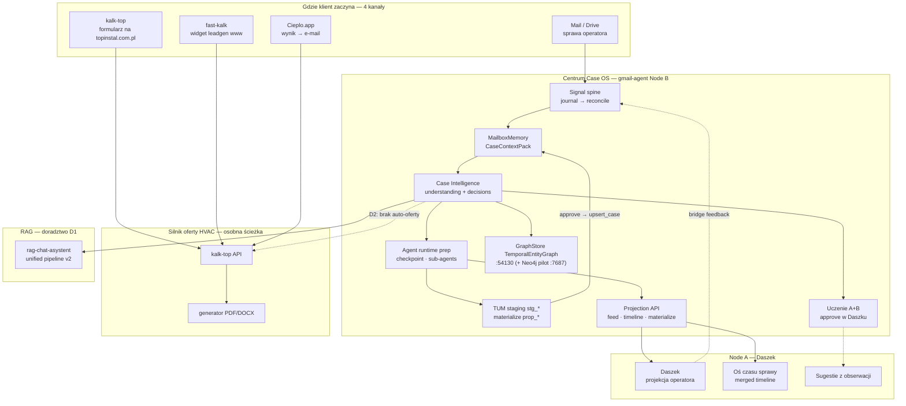

### Diagram 2 — Cztery drogi do oferty i obsługi

<!-- @diagram hostId=system-mermaid-pipeline diagramKey=global.pipeline renderMode=static -->

Cztery równoległe historie (mapowanie journeys): **1** ≈ `J-LEAD-DISPATCH` (kalk-top), **2** ≈ `J-LEAD-DISPATCH` (fast-kalk primary), **3** ≈ `J-CUSTOMER-EMAIL` (bounded — approve TAK, live send NIE), **4** ≈ `J-CIEPLO-REVIEW` (mocked E2E). Ścieżka mailowa: **brak auto-oferty (D2)**; operator zatwierdza w Daszku; bridge JSONL wraca do reconcile; **HITL send z UI jest fail-closed** — ręczna wysyłka pod freeze. Cieplo: intake → kalk → PDF → mail review (osobny SoT workflow).

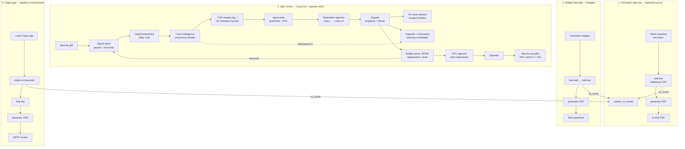

### Diagram 3 — Etapy zlecenia Cieplo

<!-- @diagram hostId=system-mermaid-cieplo diagramKey=global.cieplo renderMode=dynamic-cieplo-states -->

Journey `J-CIEPLO-REVIEW` (`PASS_MOCKED_E2E`). Zlecenie przechodzi: RECEIVED → … → DOCUMENT_REQUESTED → **PDF_READY** → EMAIL_SENT → DONE, albo **DOCUMENT_READY_DEGRADED** (stop bez maila; retry = pełny re-run od fetch gdy `readiness.retryable`). Stan zdegradowany oznacza ofertę bez pełnego artefaktu PDF — **nie** przechodzi automatycznie do EMAIL_SENT. Proof lokalny jest mockowany — nie pełny live mutate. Liczby przy stanach w UI filtrują oś czasu.

_W UI przy nazwach stanów pojawiają się liczby aktywnych zleceń na podstawie ostatnich zdarzeń na osi czasu._

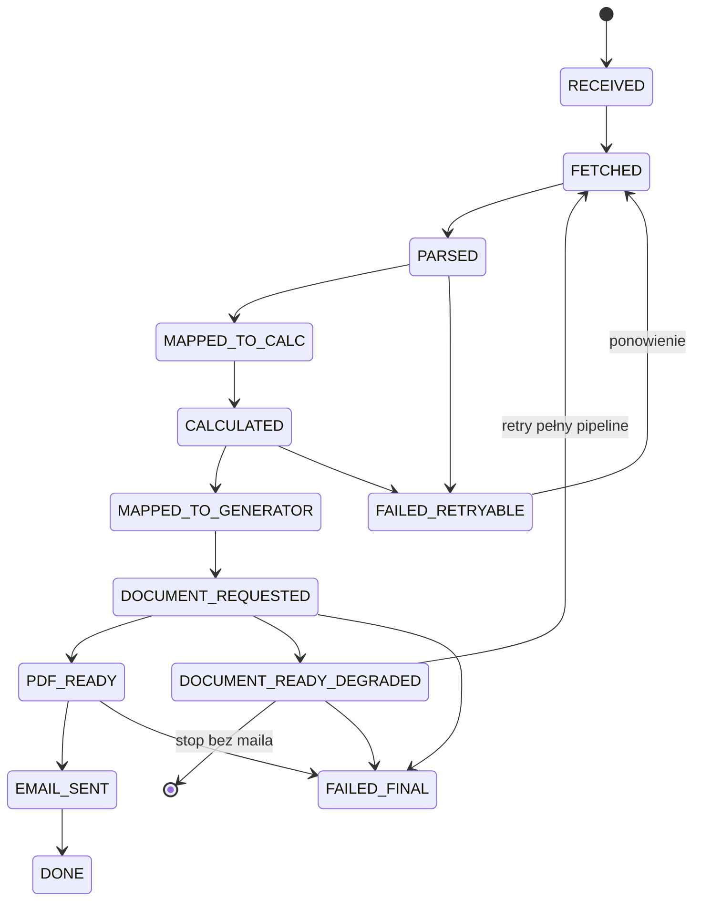

### Diagram 4 — Kręgosłup Case OS (signal spine)

<!-- @diagram hostId=system-mermaid-case-os diagramKey=global.case_os renderMode=static -->

Serce gmail-agenta (`J-CUSTOMER-EMAIL` + learning). Obserwacja → CanonicalSignal → SignalJournal → reconcile → MailboxMemory lub **TUM** (`stg_*`). Approve → **materialize_bridge** → `upsert_case` → linked reconcile. Dalej: CaseContextPack, agent `prep`, uczenie A/B, **GraphStore TemporalEntityGraph** (:54130), Neo4j pilot, projekcja Daszek. Bridge drain: JSONL `bridge_queue` (workflow `DASZEK-COMMAND-OUTBOX-DRAIN` poza overlay proof).

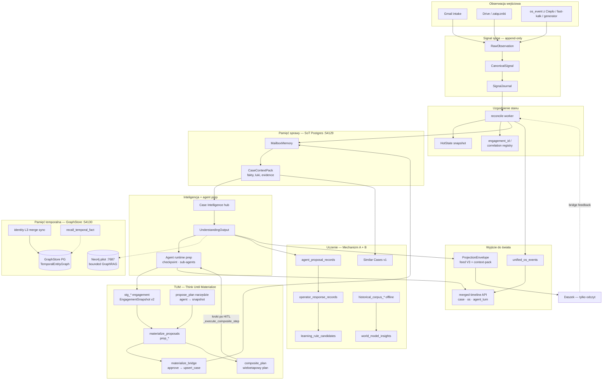

### Diagram 5 — Warstwa AI Operating System

<!-- @diagram hostId=system-mermaid-ai-os diagramKey=global.ai_os renderMode=static -->

Ten diagram pokazuje **wyłącznie warstwę operacyjną AI OS** — to, co w kodzie siedzi w gmail-agent Node B (Postgres `:54129`). Celowo **nie ma** tu kalkulatora, generatora PDF, Cieplo ani WordPressa: to produkty i kanały, które podpinają się do tej warstwy, a nie jej część.

**Po co osobny widok:** Diagram 1 pokazuje ekosystem dla klienta i operatora. Diagram 4 rozwija kręgosłup sygnałów. Diagram 5 odpowiada na pytanie architekta: _gdzie powstaje stan sprawy, pamięć, rozumienie i decyzje_ — niezależnie od tego, skąd przyszedł lead.

**Pięć warstw (od wejścia do projekcji):**

- **L1 — Obserwacja:** surowe wejście z Gmaila, Drive i zdarzeń HTTP z innych repozytoriów (`gmail_signal_adapter`, `drive_ingest_runtime`, `POST /internal/os-events`).
- **L2 — Kręgosłup:** append-only journal, reconcile, replay i rejestr `engagement_id` (`signal_journal`, `signal_reconciler`, `correlation_registry`).
- **L3 — Stan:** SoT sprawy w `MailboxMemory` oraz ledger cross-repo w `unified_os_events` (`mailbox_memory_store`, `correlation_registry/schema.py`).
- **L4 — Inteligencja:** kontekst, rozumienie, kandydaci decyzji, polityki i propozycje działań (`CaseContextPack`, `build_case_intelligence_layer`, `decision_pipeline`).
- **L4 — LLM i agenci:** centralny router modeli (`run_central_structured_stage`), Skrzat (`skrzat_copilot`), agent runtime (`execute_agent_run`, MCP) — **doradztwo i kompozycja**, nie magazyn prawdy.
- **L5 — Projekcja:** read API dla operatora — feed, context-pack, snapshot (`build_operator_projection_snapshot`, `api_app.py`). Nie jest magazynem prawdy.

**Dwa magazyny prawdy (ważne):**

- **SoT sprawy** — `MailboxMemory` + `SignalJournal`: wiadomości, fakty, chunks, historia sygnałów. To prawda operacyjna Case OS.
- **SoT biurka agenta** — `operator_engagement_snapshots` (`EngagementSnapshot v2`): gorący stan pracy operatora, bramki HITL, pamięć agenta na engagement. Osobna tabela od `mailbox_memory_snapshots` (komentarz w `agent_runtime/AGENT_RUNTIME_SCHEMA.sql`: _„SoT for operator desk”_).

**LLM nie jest SoT.** Modele (Groq primary przez `LLM_PRIMARY_PROVIDER=groq`, planer agenta przez `meta-llama/llama-4-scout-17b-16e-instruct` lub `openai/gpt-4o-mini` zależnie od środowiska) doradzają w kontrolowanych etapach: case guidance, business reasoning, projection composer, Skrzat (`SKRZAT_ANSWER_MODE=deterministic|llm`). Wynik trafia do kontraktów JSON (np. `UnderstandingOutput`, `SkrzatAnswerResult`) lub projekcji — zapis operacyjny idzie do Postgres i journalu (`agent_runtime_turns`), nie do pamięci modelu. Worker gmail-agent (`signal-worker --loop --verbose`) cyklicznie odpytuje Gmail API i przetwarza nowe sygnały w czasie rzeczywistym.

- **L4 — Agent runtime** (`agent_runtime/`, domyślnie ON przy `CASE_OS_RUNTIME_PROFILE=full`):
- **Jedyny tryb wykonawczy:** `AGENT_RUNTIME_MODE=prep` (HITL + guardrails). **`primary` trwale zablokowany** (`ConfigError` przy starcie).
- **Checkpoint PG:** `AGENT_CHECKPOINT_STRICT=1` — resume po restarcie; tury w `agent_runtime_turns`.
- **Sub-agenty:** scoped allowlist narzędzi (`tools_for_sub_agent`) — bounded multi-agent bez CrewAI.
- **Planner LLM:** `openai/gpt-oss-120b` (primary przez Groq) + fallback `llama-3.3-70b-versatile`.
- **TUM:** staging `stg_*` → propozycje `prop_*` → `POST /engagements/{id}/materialize/approve` lub HITL `action_id=prop_*` → `materialize_bridge` → `upsert_case` → linked reconcile. TTL staging: `AGENT_STAGING_TTL_HOURS`.
- **Policy guardrails** (`policy_guardrails.py`): `send_email`, `auto_send`, `create_offerdto`, `archive_gmail`, `calendar_live_write` — zablokowane **zawsze**.
- **Journey `J-CUSTOMER-EMAIL`:** signal → staging/case → agent prep → HITL approve. **Status: `PASS_LOCAL_BOUNDED`** (bez live send).
- **Follow-up:** guard blokuje `extract_facts_from_text` dla istniejących caseów; fallback planera → `propose_mutation` gdy LLM halucynuje narzędzie.
- Pętla `execute_agent_run`, journal turów, narzędzia MCP.
- **Mechanizm A (pętla rozbieżności):** `agent_proposal_records` → `operator_response_records` → `learning_rule_candidates` (approve w Daszku → dopiero semantic/playbook).
- **Mechanizm B (model świata):** offline `historical_corpus_*` → `world_model_insights` (approve → planner context).
- **Similar Cases v1:** SQL overlap v0 + approved rules + approved insights → `history_tray` (role `precedent`).
- **Merged timeline:** `GET /engagements/{id}/timeline` — `case_event` + `os_event` + `agent_turn` (Daszek: „Oś czasu sprawy”).
- **Pamięć temporalna:** GraphStore PG `:54130` (`TemporalEntityGraph`, `recall_temporal_fact`); L3 identity merge → `sync_identity_merge_to_temporal_graph`. Neo4j `:7687` = bounded GraphRAG pilot (`neo4j_pilot.py`), nie główny magazyn temporalny. Usunięte dead paths: `recall_entity_facts`, `temporal_ingest.py`, `memory_consolidation_worker`.
- **Identity L2:** binding suggestions API (`GET/POST /identity/binding-suggestions*`); L3 merge tylko po sesji operatora.

**Granice ważne dla operatora:** magazyn prawdy jest w Postgres, nie w UI ani w odpowiedzi LLM. Korekta operatora wraca mostem (bridge) i przechodzi ponowne reconcile.

**Łańcuch Understanding → Decision → Proposal** jest formalny w kodzie; domyślnie włączony (`full`); killswitch: `EMERGENCY_INTELLIGENCE_KILLSWITCH=1` lub profil `minimal`.

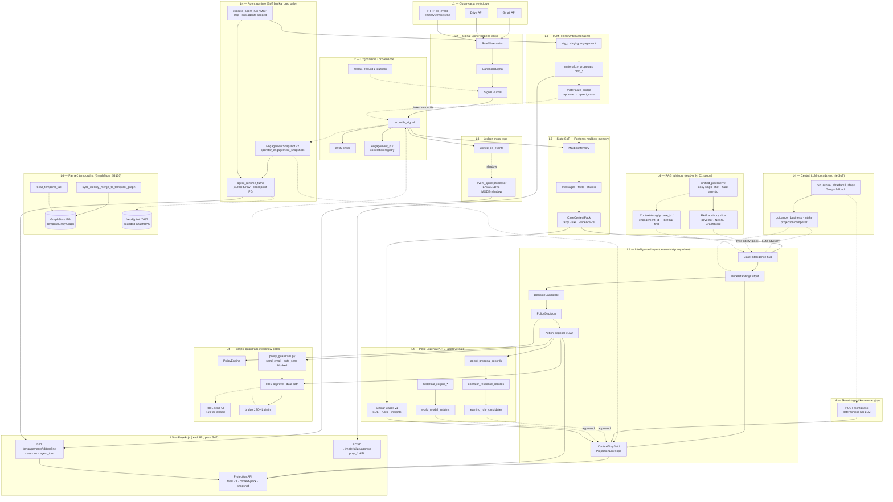

---

## Moduły — jak działa każdy element

<!-- @section-modules -->

Poniżej osobne diagramy dla każdego produktu w ekosystemie TOP-INSTAL. Opisy są dla klienta i operatora — bez żargonu technicznego.

### kalk-top — kalkulator ofertowy

<!-- @module moduleId=kalk-top -->

Oficjalny kalkulator firmy TOP-INSTAL. To tutaj powstaje właściwa oferta na pompę ciepła — zarówno gdy klient wypełnia formularz na stronie, jak i gdy inne systemy (widget, Cieplo) proszą o kalkulację. **Nie jest centrum Case OS** — emituje zdarzenia do osi systemu, ale nie prowadzi spraw mailowych.

#### Ścieżka klienta na stronie firmowej

<!-- @diagram hostId=system-mmd-kalk-top-pipeline diagramKey=module.kalk-top.pipeline renderMode=static -->

Klient wchodzi na stronę TOP-INSTAL, opisuje budynek i oczekiwania, a system liczy zapotrzebowanie na ciepło i dobiera urządzenia. Na końcu widzi cenę i może poprosić o PDF na e-mail lub pobrać dokument — bez dzwonienia, jeśli dane są kompletne.

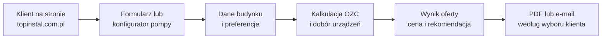

#### Jak działa w środku

<!-- @diagram hostId=system-mmd-kalk-top-arch diagramKey=module.kalk-top.arch renderMode=static -->

Formularz i konfigurator to tylko „twarz” dla klienta. W środku jeden serwis przyjmuje dane, przelicza je regułami firmy (OZC, dobór pompy, cennik) i zwraca gotową ofertę. PDF tworzy osobny moduł generator — kalk-top dostarcza mu wyłącznie ustalone liczby i parametry. Po kalkulacji system może zgłosić zdarzenie na wspólnej osi (unified_os_events), ale **nie zapisuje sprawy mailowej**.

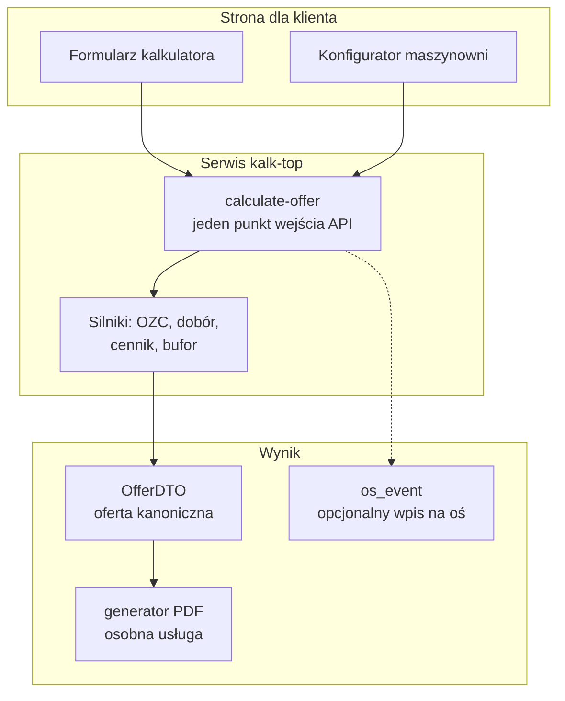

### daszek — biurko operatora

<!-- @module moduleId=daszek -->

Panel, w którym pracownik TOP-INSTAL widzi najważniejsze sprawy, odpowiada klientom i sprawdza stan systemu. Daszek **nie jest magazynem prawdy** — pokazuje projekcję z gmail-agent (feed V3, context-pack) i przekazuje feedback operatora mostem (bridge queue). W szczegółach sprawy: **Oś czasu sprawy** (3 źródła: sprawa · OS · agent) oraz **Sugestie z obserwacji** (kandydaci zasad z Mechanizmu A — approve/odrzuć). Nie wysyła ofert ani maili sam z siebie.

#### Typowy dzień operatora

<!-- @diagram hostId=system-mmd-daszek-workflow diagramKey=module.daszek.workflow renderMode=static -->

Nowy sygnał trafia na biurko jako **projekcja** albo **TUM** (`stg_*` / `prop_*`). Operator: Case Intelligence, Skrzat, oś czasu, learning candidates, materialize approve, HITL **approve** szkicu. **`/agent-hitl/send` = 410** — brak automatycznej wysyłki z UI; operator wysyła ręcznie poza fail-closed endpointem. Feedback wraca bridge JSONL → Node B drain.

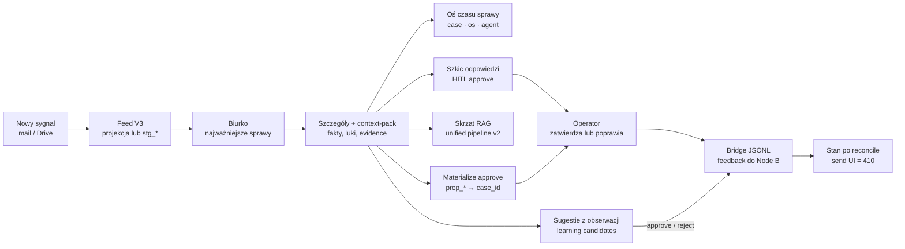

#### Dlaczego Daszek tylko pokazuje

<!-- @diagram hostId=system-mmd-daszek-arch diagramKey=module.daszek.arch renderMode=static -->

Prawdziwe dane o mailach i sprawach siedzą w gmail-agent (Node B) — MailboxMemory, SignalJournal, unified*os_events, agent_runtime_turns, TUM staging. Daszek odświeża przez proxy read-only; zatwierdza materializację (`prop*\*`), learning candidates i HITL przez POST do Node B. Zakładka System (diagramy + oś) oraz w sprawie: merged timeline i learning API przez V3 proxy.

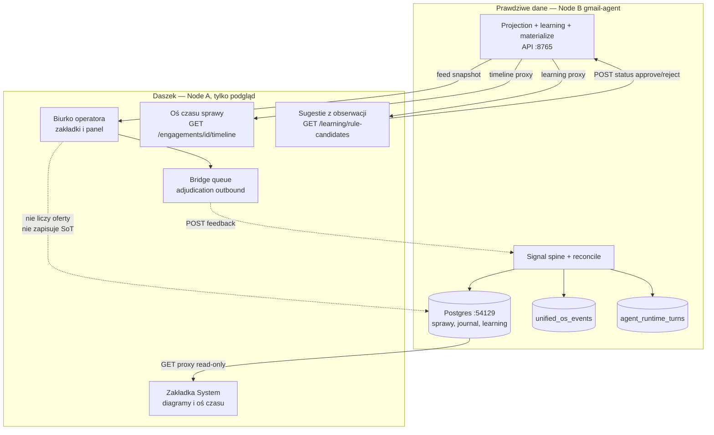

#### Feed V3 i most operatora

<!-- @diagram hostId=system-mmd-daszek-feed diagramKey=module.daszek.feed renderMode=static -->

Feed to „lista spraw na ekranie” — zbudowana z ProjectionEnvelope, nie z bezpośredniego odczytu Gmaila. Gdy operator coś poprawia (treść, status, decyzja), Daszek nie zapisuje tego lokalnie w WordPressie jako prawdy — wrzuca zadanie na most, gmail-agent je rozpatruje (adjudication) i po reconcile aktualizuje pamięć. Dzięki temu wszyscy widzą ten sam stan sprawy.

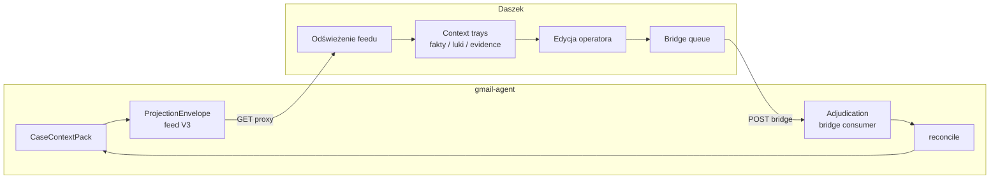

### rag-chat-asystent — baza wiedzy AI

<!-- @module moduleId=rag-chat-asystent -->

Silnik odpowiedzi na pytania o regulaminy, gwarancje, dobór urządzeń i procedury. Używany przez **Skrzat** w Daszku (w kontekście sprawy) oraz przez **widget** czatu na stronie — ale **nie zastępuje kalkulatora ofertowego** i nie zapisuje sprawy jako SoT.

**Stan 2026-08-03:** Indeks dokumentów na **pgvector** (PostgreSQL); ChromaDB nie jest kanonicznym backendem lokalnym. Gating `GATING_MEDIUM_TOP1=0.28` (konfigurowalny). Pipeline: pgvector + BM25 + rerank + gating + LLM. Journey RAG poza FINAL-PROOF overlay (`RAG-CHAT-ASYSTENT-QUERY-AND-INGEST-PIPELINE` w `historical_out_of_overlay`).

**Znane ograniczenie:** Dokumenty CP2025 (regulamin PPCP, instrukcje WOD/DPZ) to PDFy prawnicze (~200-500KB). Ich treść nie odpowiada na naturalne pytania typu "Jakie są warunki dofinansowania?" — stąd dodanie FAQ w formacie Markdown. pgvector direct query zwraca trafienia, ale gating pipeline odrzuca je jako LOW confidence (domyślny próg `GATING_MEDIUM_TOP1=0.28` jest zbyt wysoki dla krótkich fragmentów prawniczych). **Zalecenie:** utrzymywać FAQ w Markdown jako uzupełnienie PDFów.

#### Od dokumentu do odpowiedzi

<!-- @diagram hostId=system-mmd-rag-chat-pipeline diagramKey=module.rag-chat.pipeline renderMode=static -->

Firma wrzuca dokumenty (regulaminy, instrukcje, cenniki hierarchicznie) do indeksu. Produkcyjny `/chat` to **`run_core_chat_pipeline`** (`RAG_PIPELINE_V2`); `unified_pipeline v2` jest **advisory-only** (D1). Abstain = `mode=no_answer` / `NO_RELIABLE_INFO_MESSAGE` (nie SoT `no_reliable_evidence`). Odpowiedź może wskazać źródło — bez liczenia oferty (D1).

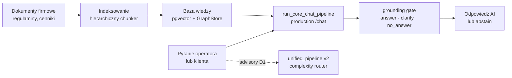

#### Dwie warstwy pamięci

<!-- @diagram hostId=system-mmd-rag-chat-arch diagramKey=module.rag-chat.arch renderMode=static -->

pgvector = dokumenty semantyczne. **GraphStore `:54130`** = `TemporalEntityGraph` (fakty encji, identity L3 merge, `recall_temporal_fact`). Neo4j `:7687` = opcjonalny **pilot** GraphRAG, nie SoT temporalny. Hybrid retrieval + production **`run_core_chat_pipeline`** (unified_pipeline v2 = advisory). Sprawa operacyjna = MailboxMemory w gmail-agent.

```mermaid
flowchart TB
  subgraph ingest_path["Uzupełnianie wiedzy"]
    files["Pliki i dokumenty"]
    pgvec[("pgvector (PostgreSQL)<br/>wyszukiwanie semantyczne")]
    graph[("GraphStore :54130<br/>TemporalEntityGraph")]
    neo4j_graph[("Neo4j pilot :7687<br/>bounded GraphRAG")]
  end
  subgraph runtime["Odpowiedzi na żywo"]
    unified["unified_pipeline v2"]
    api["API chat RAG<br/>port 8000"]
    llm["Model językowy<br/>z kontekstem z bazy"]
  end
  files --> pgvec
  files --> graph
  files -.-> neo4j_graph
  pgvec --> unified
  graph --> unified
  neo4j_graph -.-> unified
  unified --> api --> llm
```

#### Gdzie RAG siedzi w ekosystemie

<!-- @diagram hostId=system-mmd-rag-chat-ecosystem diagramKey=module.rag-chat.ecosystem renderMode=static -->

RAG ma **dwa wejścia**: widget na stronie www (pytanie anonimowego odwiedzającego) i Skrzat w Daszku (pytanie operatora w kontekście sprawy). Skrzat nie czyta Gmaila bezpośrednio — dostaje kontekst z CaseContextPack przez proxy gmail-agenta. Przy `case_id` / `engagement_id` backend RAG idzie ścieżką **ContextHub** (D1), nie KB-first. Oba kanały korzystają z tego samego serwisu rag-chat-asystent; różni się otoczka i zakres kontekstu.

```mermaid
flowchart TB
  subgraph public_web["Strona publiczna"]
    visitor["Odwiedzający www"]
    widget["rag-widget<br/>WordPress"]
    visitor --> widget
  end
  subgraph operator_desk["Biurko operatora"]
    op["Operator w Daszku"]
    skrzat["Skrzat<br/>panel w sprawie"]
    op --> skrzat
  end
  subgraph case_os["gmail-agent — kontekst sprawy"]
    proxy["Node B proxy<br/>context-pack read-only"]
    pack["CaseContextPack"]
    pack --> proxy
  end
  subgraph rag_backend["rag-chat-asystent"]
    api["RAG API :8000"]
    router["handle_chat_message<br/>scope → ContextHub"]
    unified["unified_pipeline v2<br/>adaptive router"]
    pgvec[("pgvector (PostgreSQL)")]
    graph[("GraphStore temporal<br/>+ Neo4j pilot")]
    api --> router
    router --> unified
    unified --> pgvec
    unified --> graph
  end
  widget -->|"pytanie bez scope"| api
  skrzat -->|"pytanie + engagement"| proxy
  proxy --> skrzat
  skrzat -->|"case_id / engagement_id"| api
  api --> widget
  api --> skrzat
```

#### Granica: doradztwo (D1) vs oferta (D2)

<!-- @diagram hostId=system-mmd-rag-chat-boundary diagramKey=module.rag-chat.boundary renderMode=static -->

RAG i Case Intelligence **doradzają** — tłumaczą regulaminy, podpowiadają brakujące dane, proponują szkic maila. Przy scope sprawy (`case_id` / `engagement_id`) RAG używa **ContextHub** — kontekst ze sprawy, bez skrótu KB-first. **Nie uruchamiają** calculate-offer ani nie wysyłają PDF oferty bez operatora. Kalkulacja HVAC to osobna ścieżka (kalk-top / Cieplo / fast-kalk). Agent runtime (`prep`) i guardrails blokują outbound zawsze.

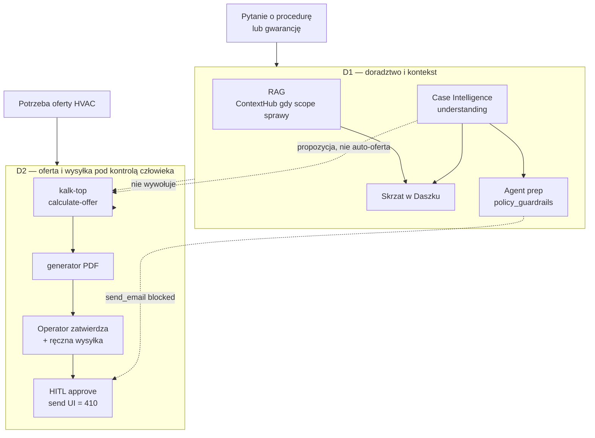

### rag-widget — czat na stronie www

<!-- @module moduleId=rag-widget -->

Mała wtyczka WordPress, która wstawia okienko czatu na stronę klienta. Sama nie przechowuje wiedzy — tylko przekazuje pytania do RAG backendu i pokazuje odpowiedź. **Nie ma dostępu do spraw ani feedu Daszka.**

#### Rola widgetu na stronie

<!-- @diagram hostId=system-mmd-rag-widget-arch diagramKey=module.rag-widget.arch renderMode=static -->

Odwiedzający stronę widzi przycisk czatu i może zadać pytanie o ofertę, montaż lub dokumenty. Widget wysyła pytanie do centralnego serwera RAG i wyświetla odpowiedź — jak okienko bankomatu podłączone do serwera w banku. Jeśli RAG jest niedostępny, widget sam z siebie nie „wie” odpowiedzi. Dla pełnej oferty HVAC klient nadal powinien trafić w formularz kalk-top lub kontakt mailowy.

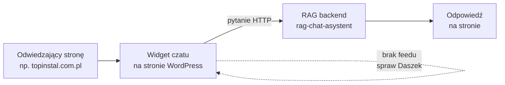

### gmail-agent — Case OS: poczta, pamięć, inteligencja

<!-- @module moduleId=gmail-agent -->

**Platforma operacyjna** całego TOP-INSTAL AI-OS: czyta skrzynkę i Drive, buduje kręgosłup sygnałów, utrzymuje pamięć spraw (SoT), uruchamia Case Intelligence, emituje projekcję do Daszka i zbiera feedback operatora. To nie „tylko obsługa maila” — to centrum, do którego podpinają się oferta, RAG i oś zdarzeń.

**Stan 2026-08-03:** Journey `J-CUSTOMER-EMAIL` = `PASS_LOCAL_BOUNDED` (local tests; **bez** live Gmail send). Pipeline agentowy: signal → staging/TUM → graph → extract_facts / propose_mutation → HITL approve. Event Spine lokalnie: **`MODE=shadow`**. `DASZEK_V2_PUSH=0`. Storage RAG: pgvector. HITL send z Daszka: **410 fail-closed**. Plugin-y WP lokalnie: TopInstalGenerator, TopInstalLeadWidget, HvacRagChat.

#### Od maila do decyzji operatora

<!-- @diagram hostId=system-mmd-gmail-agent-pipeline diagramKey=module.gmail-agent.pipeline renderMode=static -->

Wiadomość → SignalJournal → sprawa lub **TUM** (`stg_*`). Case Intelligence + agent **`prep`**. Operator: materialize (`prop_*`) i HITL **approve**. Endpoint send w Daszku = **410**. Feedback: bridge JSONL → drain → reconcile (`J-CUSTOMER-EMAIL`).

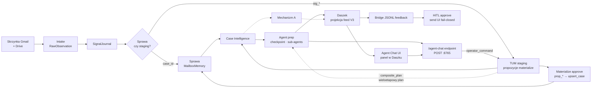

#### Kręgosłup sygnału (signal spine)

<!-- @diagram hostId=system-mmd-gmail-agent-spine diagramKey=module.gmail-agent.spine renderMode=static -->

Zanim powstanie „sprawa na biurku”, system normalizuje obserwacje: surowy mail staje się CanonicalSignal, wpis trafia do append-only SignalJournal, a worker reconcile scala je z MailboxMemory i rejestrem korelacji (engagement_id). To kręgosłup, na którym stoi cała spójność danych — bez niego moduły by się rozjeżdżały.

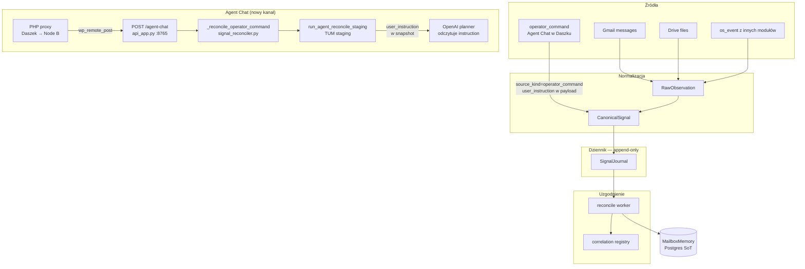

#### Pamięć sprawy i Case Intelligence

<!-- @diagram hostId=system-mmd-gmail-agent-intel diagramKey=module.gmail-agent.intel renderMode=static -->

MailboxMemory trzyma fakty o kliencie i sprawie. Z niej buduje się **CaseContextPack** — paczka z faktami, lukami (czego brakuje) i dowodami (evidence, w tym **Similar Cases v1**: SQL overlap + approved rules + world insights). **Case Intelligence** czyta paczkę i produkuje UnderstandingOutput. Propozycje agenta trafiają do **Mechanizmu A** (`agent_proposal_records`). **HotState** to szybki snapshot do odczytu bez pełnego reconcile.

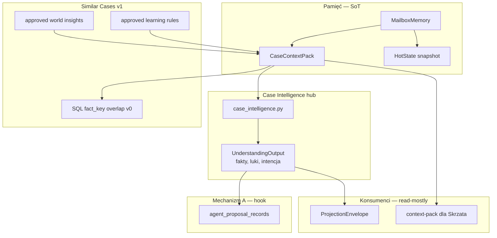

#### Pipeline decyzyjny

<!-- @diagram hostId=system-mmd-gmail-agent-decision diagramKey=module.gmail-agent.decision renderMode=static -->

Łańcuch: **DecisionCandidate** → **PolicyDecision** → **ActionProposal**. HITL **approve** zapisuje decyzję operatora; **live send z UI jest fail-closed**. Dual-path approve: `hitl/approve` oraz `materialize/approve` (workflow `HITL-PROPOSAL-APPROVAL-DUAL-PATH`).

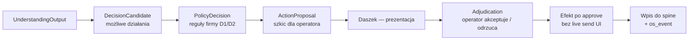

#### Pętla operatora: bridge → reconcile

<!-- @diagram hostId=system-mmd-gmail-agent-bridge diagramKey=module.gmail-agent.bridge renderMode=static -->

Zmiana operatora → **bridge_queue.jsonl** (żywy mechanizm; tabela `wp_daszek_command_outbox` to równoległy/historyczny tor). Node B: `maybe_worker_bridge_drain_tick` → REST fetch/complete → adjudication → **reconcile**. Feed: poll/proxy; auto-push lokalnie **OFF** (`DASZEK_V2_PUSH=0`; workflow `DASZEK-FEED-PUSH-NO-RETRY`).

```mermaid
flowchart TB
  subgraph node_a["Daszek"]
    ui["Edycja w UI"]
    bq["Bridge queue<br/>outbound"]
    ui --> bq
  end
  subgraph node_b["gmail-agent"]
    bridge_in["Bridge consumer"]
    adj["Adjudication"]
    rec["reconcile"]
    mm["MailboxMemory"]
    feed["feed V3 projection"]
    bq -->|"POST"| bridge_in
    bridge_in --> adj
    adj --> rec
    rec --> mm
    mm --> feed
  end
  feed -->|"GET proxy"| ui
```

#### Agent Chat Core — czat z agentem w Daszku

<!-- @diagram hostId=system-mmd-agent-chat-flow diagramKey=module.gmail-agent.agent-chat renderMode=static -->

Dodany 2026-06-23. Operator wydaje polecenie agentowi z panelu sprawy w Daszku. Agent wykonuje je przez istniejący silnik TUM, używając narzędzia propose_plan do wieloetapowych planów (composite_plan).

**Przepływ:** Daszek (JavaScript renderAgentChatPanel) -> PHP proxy (api-v2.php) -> Node B (POST /agent-chat) -> \_reconcile_operator_command -> run_agent_reconcile_staging (TUM) -> execute_agent_run z user_instruction.

**Nowe komponenty:**

- signal_reconciler.\_reconcile_operator_command - routing operator_command do TUM
- api_app.py - endpoint POST /agent-chat
- handlers.propose_plan - narzędzie agenta do composite_plan
- materialize.\_execute_composite_step - wykonanie planu krok po kroku
- EngagementSnapshotV2.user_instruction - pole na prompt operatora
- openai_agent_client.\_build_messages - wstrzyknięcie user_instruction do system promptu
- Daszek app.js - panel czatu
- Daszek api-v2.php - proxy REST

**Wzorce bezpieczeństwa:**

- Outbound tools (send_email, auto_send) zablokowane w guardrails / HITL-only w kodzie
- Daszek `/agent-hitl/send` = **410 fail-closed** pod Gmail read-only freeze
- propose_plan wymaga zatwierdzenia operatora (hitl_gate.required=True)
- Cost gate działa również dla operator_command

```mermaid
flowchart TB
  subgraph daszek_ui["Daszek \u2014 panel czatu"]
    chat_input["Pole tekstowe + przycisk Wyslij"]
    chat_history["Historia rozmowy"]
    hitl_btn["Przycisk Zatwierdz HITL"]
  end
  subgraph php["PHP proxy"]
    proxy["api-v2.php\nwp_remote_post"]
    chat_input --> proxy
  end
  subgraph node_b["Node B :8765"]
    endpoint["POST /agent-chat\napi_app.py"]
    build_signal["build_canonical_signal\nsource_kind=operator_command"]
    reconcile["_reconcile_operator_command"]
    tum_staging["run_agent_reconcile_staging"]
    inject["user_instruction -> snapshot"]
    planner_inject["OpenAI planner\nodczytuje instruction"]
    propose["propose_plan narzedzie"]
    composite["_execute_composite_step"]
    proxy --> endpoint
    endpoint --> build_signal
    build_signal --> reconcile
    reconcile --> tum_staging
    tum_staging -->|"EngagementSnapshot"| inject
    inject -->|"snapshot.user_instruction"| planner_inject
    planner_inject --> propose
    propose -->|"composite_plan proposal"| composite
    composite -->|"wyniki krok\xf3w"| endpoint
  end
  endpoint -->|"JSON response"| proxy
  proxy --> chat_history
  tum_staging --> hitl_btn
```

#### Agent runtime — prep only, guardrails

<!-- @diagram hostId=system-mmd-gmail-agent-agent-runtime diagramKey=module.gmail-agent.agent-runtime renderMode=static -->

Agent runtime (`agent_runtime/`) działa domyślnie przy profilu `full`. **Jedyny dozwolony tryb:** `AGENT_RUNTIME_MODE=prep`. **`primary` → ConfigError**. **Checkpoint PG** (`AGENT_CHECKPOINT_STRICT=1`) — resume po restarcie. **Sub-agenty** z scoped allowlist. `policy_guardrails.py` blokuje zawsze outbound tools. Tury w `agent_runtime_turns`; biurko w `operator_engagement_snapshots` (EngagementSnapshot v2). **Narzędzia agenta (z budgetem na run):** `query_anything` (bez limitu), `read_google_drive_file` (5), `extract_facts_from_text` (3), `check_cp2025_eligibility` (5), `call_kalk_top_quote` (2), `request_operator_clarification` (3), `report_gaps_and_stop` (1), `retry_hard_parse` (bez limitu), `propose_mutation` (10), `propose_plan` (5).

```mermaid
flowchart TB
  subgraph profile["Profil runtime"]
    full["CASE_OS_RUNTIME_PROFILE=full<br/>domyślnie"]
    kill["EMERGENCY_INTELLIGENCE_KILLSWITCH=1<br/>→ minimal"]
  end
  subgraph agent["Agent runtime prep"]
    run["execute_agent_run / MCP"]
    sub["sub_agents<br/>scoped tools_for_sub_agent"]
    ckpt["checkpoint PG strict<br/>resume po restarcie"]
    guard["policy_guardrails.py"]
    tools["Narzędzia agenta<br/>w tym propose_plan, retry_hard_parse"]
    propose["propose_plan → composite_plan<br/>wieloetapowy plan"]
    chat_channel["Agent Chat<br/>operator_command"]
    turns[("agent_runtime_turns")]
    eng[("operator_engagement_snapshots")]
    run --> sub --> guard
    run --> tools
    tools --> propose
    run --> ckpt --> turns
    run --> eng
    propose --> eng
    chat_channel --> run
    propose -->|"hitl_gate.required"| eng
  end
  subgraph blocked["Trwale zablokowane"]
    primary["AGENT_RUNTIME_MODE=primary<br/>ConfigError"]
    outbound["send_email · auto_send<br/>HITL only"]
  end
  full --> run
  kill -.->|"wyłącza inteligencję"| run
  guard -.-> outbound
  primary -.->|"start fail"| run
```

#### Mechanizm A — pętla rozbieżności operator–agent

<!-- @diagram hostId=system-mmd-gmail-agent-learning-a diagramKey=module.gmail-agent.learning-a renderMode=static -->

Gdy agent proponuje działanie, a operator robi coś innego (zatwierdza z edycją, odrzuca, ignoruje, wybiera inną akcję), system zapisuje parę propozycja↔odpowiedź. Z rozbieżności powstają **learning_rule_candidates** — operator zatwierdza lub odrzuca w Daszku (`Sugestie z obserwacji`). Dopiero approved trafia do semantic/playbook i Similar Cases v1. **Bez LLM** w detekcji rozbieżności.

```mermaid
flowchart LR
  prop["ActionProposal<br/>agent lub CI"] --> hook["hook_record_agent_proposal<br/>agent_proposal_records"]
  op_act["Działanie operatora<br/>HITL · bridge · timeline"] --> detect["hook_process_operator_action<br/>operator_response_records"]
  hook --> detect
  detect --> cand["learning_rule_candidates<br/>status pending_operator"]
  cand -->|"GET /learning/rule-candidates"| dz["Daszek approve/reject"]
  dz -->|"POST .../status"| approved["approved → semantic"]
  approved --> sim["Similar Cases v1<br/>history_tray precedent"]
```

#### Mechanizm B — model świata (offline)

<!-- @diagram hostId=system-mmd-gmail-agent-learning-b diagramKey=module.gmail-agent.learning-b renderMode=static -->

Jednorazowy lub okresowy batch historycznych maili (~100+) buduje **historical*corpus*\*** tabele. CLI `world_model_distill` destyluje **world_model_insights**. Operator zatwierdza insighty w API (`GET/POST /learning/world-model-insights`). Approved insights wzbogacają planner context i Similar Cases v1 — **nie zastępują** MailboxMemory jako SoT.

```mermaid
flowchart LR
  mails["Archiwum maili<br/>historyczne"] --> ingest["CLI corpus ingest<br/>historical_corpus_*"]
  ingest --> distill["world_model_distill<br/>offline batch"]
  distill --> insights["world_model_insights<br/>pending_operator"]
  insights --> approve["Operator approve<br/>API / Daszek proxy"]
  approve --> ctx["Planner + Similar Cases v1<br/>approved only"]
```

#### Similar Cases v1 — precedensy w history_tray

<!-- @diagram hostId=system-mmd-gmail-agent-similar-cases diagramKey=module.gmail-agent.similar-cases renderMode=static -->

Deterministyczne precedensy bez LLM: **v0** — SQL overlap `fact_key` w tej samej `case_family`; **v1** — dodaje approved rules (Mechanizm A) i approved world insights (Mechanizm B). Wynik trafia do `history_tray` z rolą `precedent` w ProjectionEnvelope / context-pack.

```mermaid
flowchart TB
  pack["CaseContextPack<br/>aktywne fact_key"] --> v0["fetch_similar_case_precedent_refs<br/>SQL overlap v0"]
  rules["approved learning rules"] --> v1a["fetch_learning_rule_precedent_refs"]
  wm["approved world insights"] --> v1b["fetch_world_model_precedent_refs"]
  v0 --> merge["fetch_similar_case_precedent_refs_v1"]
  v1a --> merge
  v1b --> merge
  merge --> tray["history_tray<br/>EvidenceRef role=precedent"]
```

#### Merged timeline — trzy źródła na jednej osi

<!-- @diagram hostId=system-mmd-gmail-agent-merged-timeline diagramKey=module.gmail-agent.merged-timeline renderMode=static -->

API `GET /engagements/{engagement_id}/timeline` scala trzy lane: **case_event** (MailboxMemory), **os_event** (unified_os_events), **agent_turn** (`agent_runtime_turns`). Daszek proxy: `GET /wp-json/daszek/v3/engagements/{id}/timeline` — sekcja „Oś czasu sprawy” z filtrami źródeł.

```mermaid
flowchart LR
  subgraph sources["Trzy źródła"]
    case_ev["case_event<br/>MailboxMemory"]
    os_ev["os_event<br/>unified_os_events"]
    agent_ev["agent_turn<br/>agent_runtime_turns"]
  end
  merge["fetch_merged_engagement_timeline<br/>sort by timestamp"]
  api["GET /engagements/id/timeline"]
  dz["Daszek<br/>Oś czasu sprawy"]
  case_ev --> merge
  os_ev --> merge
  agent_ev --> merge
  merge --> api --> dz
```

#### TUM — Think Until Materialize

<!-- @diagram hostId=system-mmd-gmail-agent-tum diagramKey=module.gmail-agent.tum renderMode=static -->

**Intelligence-first:** inteligencja może działać na obserwacji **bez** natychmiastowej sprawy w MailboxMemory. Engagement `stg_*` trzyma EngagementSnapshot v2 z propozycjami `prop_*`. Operator w Daszku zatwierdza (`POST /engagements/{id}/materialize/approve` lub HITL `action_id=prop_*`) → `materialize_bridge` → `execute_materialize_proposal` → `upsert_case` → `reconcile_linked_after_materialize`. Staging wygasa po `AGENT_STAGING_TTL_HOURS` (cleanup w reconcile). **Bez approve — brak case_id.**

```mermaid
flowchart TB
  obs["Obserwacja<br/>mail · Drive · orphan triage"] --> stg["Engagement stg_*<br/>TUM staging"]
  stg --> snap["EngagementSnapshot v2<br/>materialize_proposals"]
  snap --> prop["prop_* proposal<br/>status pending"]
  prop --> op["Operator Daszek<br/>approve / reject"]
  op -->|"approve"| bridge["materialize_bridge"]
  bridge --> upsert["upsert_case<br/>case_id w MailboxMemory"]
  upsert --> linked["reconcile_linked_after_materialize"]
  linked --> pack["CaseContextPack<br/>normalna sprawa"]
  op -->|"reject"| stg
  stg -.->|"TTL expired"| cleanup["cleanup_stale_staging"]
```

#### Pamięć temporalna — Neo4j :7687 + GraphStore PG :54130

<!-- @diagram hostId=system-mmd-gmail-agent-temporal diagramKey=module.gmail-agent.temporal renderMode=static -->

Fakty o encjach żyją w **`TemporalEntityGraph` na GraphStore PG** (`:54130`, `GRAPHSTORE_DSN`). Recall: `recall_temporal_fact`. Po **L3 identity merge** → `sync_identity_merge_to_temporal_graph`. **Nie zastępuje** MailboxMemory. Neo4j `:7687` (`NEO4J_PILOT_ENABLED`) = bounded GraphRAG pilot (`neo4j_pilot.py`) — projekcja case-scoped, nie główny magazyn temporalny. Usunięte: `recall_entity_facts`, `temporal_ingest.py`, `memory_consolidation_worker`.

```mermaid
flowchart LR
  subgraph case_os["gmail-agent Node B host:8766"]
    turns["agent_runtime_turns"]
    id_api["POST /identity/.../status<br/>L3 merge"]
    recall["recall_temporal_fact"]
    id_api --> sync["temporal_identity_sync"]
  end
  subgraph gsp_main["GraphStore PG :54130 — TemporalEntityGraph"]
    gsp[("GraphStore PG<br/>TemporalEntityGraph")]
    sync --> gsp
    recall --> gsp
  end
  subgraph neo_pilot["Neo4j pilot :7687"]
    n4j[("Neo4j<br/>bounded GraphRAG")]
    turns -.-> n4j
  end
  gsp -.->|"read-only context"| agent["Agent prep planner"]
  n4j -.-> agent
```

#### Serce Node B

<!-- @diagram hostId=system-mmd-gmail-agent-arch diagramKey=module.gmail-agent.arch renderMode=static -->

gmail-agent: API host :8766 / container :8765, worker intake/reconcile/bridge drain, SignalJournal + unified_os_events, Postgres SoT, learning, agent_runtime_turns, TUM + materialize. **GraphStore :54130** = TemporalEntityGraph; **Neo4j :7687** = pilot. Daszek / Cieplo / fast-kalk / generator czytają lub emitują do tego centrum.

```mermaid
flowchart TB
  subgraph node_b["gmail-agent — Node B :8765"]
    api["API :8765<br/>projection · timeline · learning · materialize"]
    worker["Worker: intake,<br/>reconcile, bridge, staging TTL"]
    ci["Case Intelligence"]
    agent["Agent runtime prep<br/>checkpoint · sub-agents"]
    tum["TUM staging + materialize_bridge"]
    learn["divergence_loop · world_model"]
    cases[("Postgres :54129<br/>MailboxMemory + learning")]
    events[("unified_os_events")]
    journal[("SignalJournal")]
    turns[("agent_runtime_turns")]
  end
  subgraph stores["Magazyny danych"]
    graph_ext[("GraphStore :54130<br/>TemporalEntityGraph")]
    neo4j_store[("Neo4j pilot :7687<br/>bounded GraphRAG")]
  end
  subgraph consumers["Kto korzysta"]
    daszek["Daszek — feed · timeline · learning UI"]
    cieplo["cieplo / fast-kalk<br/>emitują os_event"]
    gen["generator<br/>emituje os_event"]
    rag["Skrzat — context-pack<br/>przez proxy"]
  end
  worker --> journal
  worker --> cases
  worker --> events
  agent --> turns
  agent --> tum
  tum --> cases
  ci --> cases
  learn --> cases
  api --> cases
  api --> events
  api --> turns
  agent -.-> neo4j_store
  agent -.-> graph_ext
  cases -->|"projection"| daszek
  api -->|"merged timeline"| daszek
  api -->|"learning candidates"| daszek
  events -->|"read-only proxy"| daszek
  cieplo -->|"POST"| api
  gen -->|"POST"| api
  daszek -->|"bridge feedback"| api
  cases -->|"context-pack"| rag
```

### fast-kalk — szybki formularz leadgen

<!-- @module moduleId=fast-kalk -->

Uproszczony formularz na stronie www dla klientów, którzy nie chcą od razu wypełniać pełnego kalkulatora. Zbiera minimum danych, liczy ofertę przez kalk-top i wysyła PDF do operatora. Po kalkulacji zgłasza zdarzenie na osi systemu — **nie otwiera sprawy mailowej** sam z siebie.

#### Ścieżka leadu z widgetu

<!-- @diagram hostId=system-mmd-fast-kalk-pipeline diagramKey=module.fast-kalk.pipeline renderMode=static -->

Klient wypełnia krótki formularz na stronie. System w tle uruchamia pełną kalkulację TOP-INSTAL i generuje PDF. Operator dostaje e-mail z gotową ofertą do kontaktu — może zadzwonić, doprecyzować i wysłać klientowi. Zdarzenie trafia też do unified_os_events, żeby było widać na osi czasu w Daszku.

```mermaid
flowchart LR
  www["Strona z widgetem<br/>krótki formularz"] --> lead["Zebrane dane<br/>kontakt i budynek"]
  lead --> calc["Kalkulacja<br/>przez kalk-top"]
  calc --> pdf["PDF oferty<br/>przez generator"]
  pdf --> mail_op["E-mail do operatora<br/>z załącznikiem"]
  calc --> os_ev["os_event<br/>Node B"]
  pdf -.->|"opcjonalnie"| mail_cli["E-mail do klienta"]
```

### cieplo-orchestrator — automatyzacja leadów Cieplo

<!-- @module moduleId=cieplo-orchestrator -->

Robot, który obsługuje zlecenia z kalkulatora Cieplo.app: pobiera mail z wynikiem, czyta dane, liczy ofertę TOP-INSTAL i wysyła PDF do zespołu do akceptacji. Ma **własną bazę workflow** (SoT zleceń Cieplo), ale ważne kamienie milowe zgłasza też na unified_os_events.

#### Od Cieplo.app do maila z PDF

<!-- @diagram hostId=system-mmd-cieplo-pipeline diagramKey=module.cieplo.pipeline renderMode=static -->

Gdy klient kończy kalkulację na Cieplo.app, na skrzynkę wpada e-mail z linkiem do wyniku. Orchestrator przetwarza lead (domyślnie przez API/HTTP ingress; patrz diagram ingress i granica D3), wyciąga dane budynku, liczy ofertę w kalk-top, robi PDF i wysyła go mailem do handlowca — bez ręcznego kopiowania z HTML.

```mermaid
flowchart LR
  cieplo_app["Klient kończy<br/>kalkulator Cieplo.app"] --> mail_in["E-mail z wynikiem<br/>trafia na skrzynkę"]
  mail_in --> orch["cieplo-orchestrator<br/>pobiera i czyta HTML"]
  orch --> calc["kalk-top<br/>pełna oferta TOP-INSTAL"]
  calc --> pdf["generator<br/>PDF oferty"]
  pdf --> review["Mail wewnętrzny<br/>do zespołu handlowego"]
  orch --> os_ev["os_event<br/>dla osi systemu"]
```

#### Jak lead trafia do systemu

<!-- @diagram hostId=system-mmd-cieplo-ingress diagramKey=module.cieplo.ingress renderMode=static -->

**Granica D3 (P4):** kanoniczny poll Gmail dla spraw i korespondencji jest wyłącznie w **gmail-agent spine** — nie w orchestratorze Cieplo. Orchestrator domyślnie **nie** polluje skrzynki (`CIEPLO_GMAIL_POLL_ENABLED=false`; batch zwraca `skipped: gmail_poll_disabled`); lead Cieplo wchodzi przez **API replay / HTTP ingress** (test, powtórka, integracja). Własny Gmail poll orchestratora to ścieżka **legacy / lab** — wymaga jawnego włączenia i ryzykuje duplikaty względem spine.

System sprawdza, czy da się odczytać dane klienta. Jeśli tak — tworzy zlecenie w swojej bazie i puszcza pipeline. Jeśli nie — oznacza problem do ręcznej obsługi.

```mermaid
flowchart TB
  subgraph d3["D3 — mail sprawowy (osobna ścieżka)"]
    spine["gmail-agent spine<br/>jedyny kanoniczny Gmail poll<br/>Case OS"]
  end
  subgraph sources["Ingress orchestratora Cieplo"]
    http_replay["API replay / HTTP<br/>ścieżka domyślna"]
    gmail_legacy["Gmail poll orchestratora<br/>legacy — OFF domyślnie"]
  end
  subgraph validate["Walidacja"]
    parse["Odczyt HTML<br/>i danych klienta"]
    check["Sprawdzenie<br/>czy lead jest kompletny"]
  end
  subgraph store["Zapis"]
    wf[("Baza zleceń Cieplo<br/>workflow SoT")]
    pipeline["Dalszy pipeline<br/>kalkulacja → PDF → mail"]
  end
  http_replay --> parse
  gmail_legacy -.->|"CIEPLO_GMAIL_POLL_ENABLED=true<br/>tylko lab / migracja"| parse
  spine -.->|"engagement_id / korelacja<br/>bez drugiego poll"| wf
  parse --> check
  check -->|"OK"| wf
  wf --> pipeline
  check -->|"błąd parse"| reject["Oznaczenie<br/>do ręcznej obsługi"]
```

---

**Powiązanie z UI:** po sync powstaje `daszek/public/system-diagrams-manifest.js`, który ładuje `app.js`.
