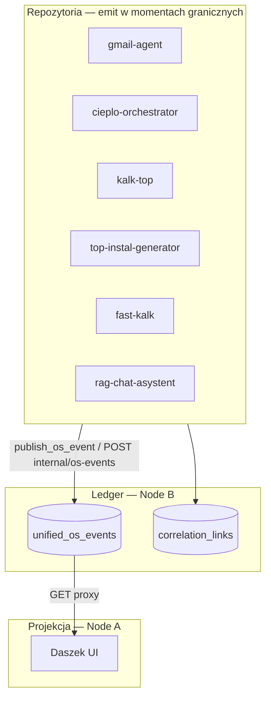

# RFC: Daszek — podgląd systemu (System Observability) + kontrakt `os_event`

| Pole              | Wartość                                                                                                                                                                                       |
| ----------------- | --------------------------------------------------------------------------------------------------------------------------------------------------------------------------------------------- |
| **Data**          | 2026-06-17                                                                                                                                                                                    |
| **Status**        | accepted                                                                                                                                                                                      |
| **Autor**         | architektura + operator (review)                                                                                                                                                              |
| **Luka (kernel)** | `gap:D4-daszek-projection` (rozszerzenie: projekcja całego OS, read-only)                                                                                                                     |
| **Powiązane**     | `EVOLUTION_BOUNDARIES.md` § Daszek ↔ SoT — plik usunięty w restrukturyzacji korpusu, nie istnieje; patrz `ARCHITECTURE_DECISIONS.md` § Granice (D4) |
| **Wizja**         | `vision/DASZEK_OPERATOR_SHELL_WIZJA_BIZNESOWA_2026-06.md` — usunięty w restrukturyzacji korpusu, nie istnieje (kontekst historyczny; ten RFC = węższy scope: **podgląd**, nie panel operacyjny) |

---

## Werdykt (jedno zdanie)

**Daszek pozostaje read-only projekcją (D4).** Docelowo pokazuje **timeline zdarzeń całego TOP-INSTAL AI-OS**, spinany przez `engagement_id`, zapisanych w `unified_os_events` (Node B) i opcjonalnych snapshotach V3 (Node A). Repozytoria **emitują momenty graniczne**; Daszek **nie steruje** pipeline’ami innych modułów.

Ten RFC definiuje kontrakt emisji oraz **kolejność wdrożenia**: najpierw **jeden emit → jeden widok → jeden proof**, potem rozszerzenie.

---

## As-Is

### Co działa

| Element                               | Stan                                                  |
| ------------------------------------- | ----------------------------------------------------- |
| `unified_os_events` (Postgres Node B) | Schema shipped (`correlation_registry/schema.py`)     |
| `publish_os_event()`                  | Best-effort emitter (`event_spine/emitter.py`)        |
| `POST /internal/os-events`            | Ingress cross-repo (orchestrator może emitować)       |
| `correlation_links` + `engagement_id` | Registry P0 — spinacz case ↔ workflow ↔ message       |
| Daszek operational feed V3            | Push z gmail-agent; UI mailowe PRO                    |
| `hitl_action_execute_requested`       | Emitowany przy HITL **send** (`agent_hitl_bridge.py`) |

### Luki (stan 2026-06-20)

| Luka                                                                | Skutek                                                                |
| ------------------------------------------------------------------- | --------------------------------------------------------------------- |
| ~~`hitl_action_approved` nie trafia do `unified_os_events`~~        | ZAMKNIETE — `agent_hitl_bridge.py` emituje od P2-closure 2026-06-20   |
| Daszek v3 proxy: brak tras `/timeline`, `/learning/rule-candidates` | UI 404 przez same-origin WP proxy; Node B endpointy istnieją          |
| Cieplo: `event_spine_emit_enabled` wymaga konfiguracji env          | Eventy workflow nie płyną do Node B bez ustawienia flagi              |
| kalk-top: `engagement_id` pusty przy standalone kalkulacji          | kalk.offer.calculated nie spina się z timeline engagement             |
| Dwa SoT biurka: `mailbox_memory_events` vs `unified_os_events`      | Niespójny podgląd — E4 backlog (deprecation mailbox_memory_snapshots) |

### Dlaczego to ma znaczenie biznesowo

Bez wspólnej osi zdarzeń **nie da się** domknąć pętli wynikowej: lead (fast-kalk / Cieplo / mail) → oferta → decyzja operatora → wynik. `engagement_id` + `unified_os_events` to fundament pod **Outcome Intelligence** (konwersja, time-to-offer, drop-off per kanał) — bez zastępowania SoT poszczególnych repo.

---

## To-Be



**Zasady nadrzędne (antywzorce — nie negocjowane):**

1. Daszek **nie woła** `calculate-offer` ani generatora.
2. Pełny `OfferDTO` **nie** jedzie w `payload` eventu — tylko `summary_pl` + `trace_id`.
3. Transkrypty RAG / chat www **nie** trafiają do timeline.
4. Emit **best-effort** — failure nie blokuje biznesu.
5. SoT stanu sprawy / workflow **zostaje** w Postgres modułu źródłowego.

---

## Warianty wdrożenia

| ID     | Opis                                                                   | Koszt  | ROI                  | Ryzyko                                   | Rekomendacja                  |
| ------ | ---------------------------------------------------------------------- | ------ | -------------------- | ---------------------------------------- | ----------------------------- |
| **W0** | Jeden event (`hitl_action_approved`) + minimalny widok Daszek + Gate B | Niski  | Dowód kontraktu E2E  | Minimalne                                | **START TUTAJ**               |
| W1     | Pełna Fala 0 (gmail-agent + cieplo emit + widok System)                | Średni | Podgląd cross-repo   | Wdrożeniowe: emit bez UI lub UI bez emit | Po W0                         |
| W2     | Fala 1: wszystkie repo graniczne                                       | Wyższy | Outcome Intelligence | Scope creep                              | Po W1                         |
| W3     | Snapshoty agregatów (`system_health`, `workflow_feed`)                 | Średni | Health strip         | Osobny kontrakt V3                       | Równolegle z W2 (opcjonalnie) |

**Rekomendacja:** **W0 → W1 → W2**. Nie uruchamiać W1 jako big-bang w trzech repo bez dowodu W0.

---

## Kontrakt: `topinstal.os_event.v1`

### Envelope (zapis w `unified_os_events`)

| Kolumna DB      | Pole logiczne   | Wymagane | Opis                                                              |
| --------------- | --------------- | -------- | ----------------------------------------------------------------- |
| `event_id`      | —               | auto     | `osevt_{uuid16}`                                                  |
| `event_type`    | `event_type`    | tak      | Namespaced: `gmail.hitl.approved`, `cieplo.workflow.pdf_ready`, … |
| `source_repo`   | `source_repo`   | tak      | `gmail-agent`, `cieplo-orchestrator`, …                           |
| `engagement_id` | `engagement_id` | zalecane | Spinacz cross-repo                                                |
| `occurred_at`   | `occurred_at`   | auto     | ISO8601 UTC                                                       |
| `payload`       | `payload`       | tak      | JSON — patrz poniżej                                              |
| `correlation`   | `correlation`   | nie      | `trace_id`, `case_id`, `workflow_id`, `session_id`, …             |

### `payload` (minimalny, operatorski)

```json
{
  "schema_version": "topinstal.os_event.v1",
  "summary_pl": "Operator zatwierdził szkic odpowiedzi",
  "status": "ok",
  "error_code": null,
  "operator_id": "…",
  "action_id": "draft_reply"
}
```

| Pole         | Zasada                                                                    |
| ------------ | ------------------------------------------------------------------------- |
| `summary_pl` | Jedna linia na timeline — **obowiązkowe** dla eventów widocznych w Daszku |
| `status`     | `ok` \| `warning` \| `error`                                              |
| PII          | Brak emaili/telefonów w cleartext; identyfikatory techniczne OK           |

### Kanały emisji

| Kanał  | API / funkcja                        | Kto                                                      |
| ------ | ------------------------------------ | -------------------------------------------------------- |
| **A**  | `publish_os_event(database_url=…)`   | Ten sam proces co SoT (gmail-agent, orchestrator worker) |
| **A′** | `POST /internal/os-events`           | Repo zewnętrzne (fast-kalk PHP, kalk-top hook)           |
| **B**  | `POST /daszek/v3/{domain}-snapshots` | Agregaty (health, lista workflow) — osobny RFC snapshot  |

### Odczyt (Daszek)

| Endpoint (propozycja)                      | Producer            | Consumer                    |
| ------------------------------------------ | ------------------- | --------------------------- |
| `GET /engagements/{id}/os-events?limit=50` | gmail-agent FastAPI | Daszek proxy (`api-v2.php`) |
| `GET /system/os-events/recent?limit=50`    | gmail-agent FastAPI | Daszek zakładka **System**  |

Auth: sesja operatora Daszek + proxy Bearer do Node B (`DASZEK_NODE_B_SERVICE_TOKEN`).

---

## Faza W0 — jeden emit, jeden widok, jeden proof

> **Cel:** zamknąć pętlę kontraktu zanim rozszerzysz scope. Unikamy „eventy w próżnię” i „pustego UI”.

### W0.1 Emit: `gmail.hitl.approved`

| Element           | Wartość                                                                                     |
| ----------------- | ------------------------------------------------------------------------------------------- |
| **Moment**        | Po sukcesie `approve_hitl_engagement()` w `agent_hitl_bridge.py`                            |
| **Dziś**          | Zwraca `adjudication_kind: hitl_action_approved` w JSON — **bez** `publish_os_event`        |
| **Zmiana**        | Wywołać `publish_os_event(event_type="gmail.hitl.approved", …)` obok istniejącego feed push |
| **Payload**       | `summary_pl`, `action_id`, `operator_id`, `case_id` w `correlation`                         |
| **engagement_id** | Z argumentu approve                                                                         |

**Symetria:** `gmail.hitl.send_requested` już istnieje jako `hitl_action_execute_requested` — W0 domyka parę approve → send w timeline.

### W0.2 Widok: jeden wiersz w Daszku

Minimalny zakres UI (nie pełna zakładka System):

- W **szczególe sprawy** (panel boczny): sekcja **„Oś systemu”** — lista max 20 eventów dla `engagement_id`.
- Jeden wiersz = `occurred_at` + `summary_pl` + badge `source_repo`.
- Pusty stan: „Brak zdarzeń systemowych dla tej sprawy”.
- **Bez** filtrów, bez paginacji, bez edycji — tylko read.

Alternatywa jeszcze węższa: jeden wiersz pod HITL po approve (toast + wpis w sekcji) — akceptowalne jako W0.0.

### W0.3 Proof Gate B (lokalny)

```text
1. preflight-local-stack.ps1 -FullStack
2. daszek_local_133_proof.py (istniejący harness HITL)
3. NOWY krok: GET engagement os-events → assert event_type=gmail.hitl.approved
4. Artefakt: knowledge/artifacts/proof-packs/daszek-os-event-w0-hitl-approved-YYYY-MM-DD.md
5. Oczekiwany stdout: DASZEK_OS_EVENT_W0_PROOF_OK
```

**Kryterium sukcesu W0:** po approve w UI widać **dokładnie jeden** wpis `gmail.hitl.approved` z poprawnym `engagement_id` i `summary_pl`.

---

## Katalog eventów (pełny — po W0)

### gmail-agent

| `event_type`                                   | Moment                                         | Priorytet |
| ---------------------------------------------- | ---------------------------------------------- | --------- |
| `gmail.hitl.approved`                          | HITL approve                                   | **W0**    |
| `gmail.hitl.send_requested`                    | (= istniejący `hitl_action_execute_requested`) | jest      |
| `gmail.feed.pushed` / `gmail.feed.push_failed` | po operational feed push                       | W1        |
| `gmail.reconcile.completed`                    | po reconcile signal                            | W1        |
| `gmail.registry.links_registered`              | (= istniejący)                                 | jest      |
| `gmail.adjudication.recorded`                  | skrót `v2_1_adjudication`                      | W2        |

Mailbox `mailbox_memory_events` pozostaje SoT szczegółów sprawy; os_event = **warstwa cross-repo i outcome**.

### cieplo-orchestrator

| `event_type`                                      | Moment               | Priorytet |
| ------------------------------------------------- | -------------------- | --------- |
| `cieplo.ingress.parse_error`                      | AMBIGUOUS            | W1        |
| `cieplo.workflow.state_changed`                   | każda `transition()` | W1        |
| `cieplo.workflow.pdf_ready`                       | `PDF_READY`          | W1        |
| `cieplo.workflow.done` / `cieplo.workflow.failed` | terminal             | W1        |

### kalk-top

| `event_type`            | Moment              | Priorytet |
| ----------------------- | ------------------- | --------- |
| `kalk.offer.calculated` | 200 calculate-offer | W2        |
| `kalk.offer.failed`     | 4xx/5xx             | W2        |

### top-instal-generator

| `event_type`                       | Moment    | Priorytet |
| ---------------------------------- | --------- | --------- |
| `generator.document.ready`         | success   | W2        |
| `generator.document.fallback_docx` | PDF→DOCX  | W2        |
| `generator.document.failed`        | hard fail | W2        |

### fast-kalk

| `event_type`                             | Moment               | Priorytet |
| ---------------------------------------- | -------------------- | --------- |
| `fastkalk.calculate.success` / `.failed` | /calculate           | W2        |
| `fastkalk.offer.delivered` / `.failed`   | /register + dispatch | W2        |
| `fastkalk.registry.failed`               | brak engagement_id   | W2        |

### rag-chat-asystent

| `event_type`                       | Moment             | Priorytet |
| ---------------------------------- | ------------------ | --------- |
| `rag.ingest.completed` / `.failed` | ingest job         | W3        |
| `rag.kb_health.snapshot`           | cron → snapshot V3 | W3        |

### rag-widget

Brak bezpośredniego emitu — agregat z RAG backendu (P3).

---

## Wpływ

| Obszar                               | W0                                                | W1+                                    |
| ------------------------------------ | ------------------------------------------------- | -------------------------------------- |
| **gmail-agent**                      | `agent_hitl_bridge.py`, `api_app.py` (GET events) | event_spine, feed push telemetry       |
| **daszek**                           | `api-v2.php` proxy, `app.js` sekcja timeline      | zakładka System                        |
| **cieplo-orchestrator**              | —                                                 | `workflow/repository.py`, event client |
| **kalk-top / generator / fast-kalk** | —                                                 | hooki emit                             |
| **contracts.json / group.yaml**      | GET os-events                                     | cross-repo POST                        |
| **OfferDTO**                         | nie dotyka                                        | nie dotyka                             |
| **Gate B**                           | nowy proof W0                                     | rozszerzenie harness                   |
| **Operator UX**                      | jeden wiersz / sekcja                             | pełny podgląd systemu                  |

---

## Ryzyka regresji

| Ryzyko                              | Mitigacja                                                                     |
| ----------------------------------- | ----------------------------------------------------------------------------- |
| Big-bang W1 (emit + UI + cieplo)    | **W0 najpierw** — jeden pionowy slice                                         |
| Eventy bez `summary_pl`             | Walidacja w emitterze; test contract                                          |
| Duplikat eventów przy retry approve | Idempotency: `correlation.approve_key` = `engagement_id` + `action_id` + hash |
| Daszek traktuje timeline jako SoT   | Copy UI: „projekcja zdarzeń — nie magazyn prawdy”                             |
| Scope creep → panel sterowania      | RFC + D4; brak POST z Daszka do kalk-top                                      |
| PII w payload                       | Review checklist per event_type                                               |

---

## Outcome Intelligence (perspektywa — poza W0)

Gdy W1–W2 są shipped, na `unified_os_events` + `engagement_id` można budować (osobne epiki):

- time-to-first-response (mail → approve)
- time-to-offer (Cieplo ingress → `kalk.offer.calculated`)
- drop-off: `pdf_ready` bez `done`
- konwersja per kanał: fast-kalk vs Cieplo vs mail

**To nie jest scope W0** — ale W0 jest warunkiem koniecznym (kontrakt + proof).

---

## Akceptacja operatora

- [x] Zaakceptowano wariant: **W0 → W1 → W2**
- [x] Zaakceptowano pierwszy event: **`gmail.hitl.approved`**
- [x] Zaakceptowano minimalny UI: **sekcja „Oś systemu” w szczególe sprawy**
- Data: 2026-06-17
- Uwagi: implementacja W0 w toku (emit + GET + proxy + UI + proof)

---

## Po implementacji W0 (checklist)

- [x] `publish_os_event` w `approve_hitl_engagement` po sukcesie
- [x] `GET /engagements/{engagement_id}/os-events` na Node B
- [x] Daszek proxy + sekcja UI (read-only)
- [x] `daszek_os_event_w0_proof.py` + proof pack
- [x] Wpis w `LAST_PROVEN_STATE.md`
- [x] Kernel-graph: krawędź `daszek → gmail-agent` GET os-events
- [ ] `gitnexus group sync` jeśli nowy REST

---

## Po W1+ (checklist)

- [x] cieplo `workflow.state_changed` / `pdf_ready` / `done` / `failed` → `/internal/os-events`
- [x] cieplo `ingress.parse_error` (AMBIGUOUS)
- [x] `gmail.feed.pushed` / `gmail.feed.push_failed` telemetry
- [x] `gmail.reconcile.completed` telemetry
- [x] `gmail.hitl.send_requested` (zamiast legacy `hitl_action_execute_requested` w nowych emitach)
- [x] Daszek zakładka **System** (`GET /system/os-events/recent`)
- [x] `daszek_os_event_w1_proof.py` → `DASZEK_OS_EVENT_W1_PROOF_OK`
- [x] Aktualizacja [`world-state.yaml`](../world-state.yaml) → `daszek.boundaries`: `system_observability_projection`

## Po W2 (checklist)

- [x] `kalk.offer.calculated` / `kalk.offer.failed` w `CalculateOfferController.php`
- [x] `fastkalk.calculate.*`, `fastkalk.offer.*`, `fastkalk.registry.failed` w lead widget
- [x] `generator.document.ready` / `.fallback_docx` / `.failed` w generatorze
- [x] `daszek_os_event_w2_proof.py` → `DASZEK_OS_EVENT_W2_PROOF_OK`
- [x] `LAST_PROVEN_STATE.md` sekcja W0+W1+W2
- [x] `world-state.yaml` links GET os-events + POST os-events edge repos
- [x] `TOPINSTAL-KERNEL-GRAPH.yaml` krawędzie read + W2 POST
- [x] proof pack `daszek-os-event-w0-w1-w2-2026-06-17.md`
- [x] `gitnexus group sync` po merge kernel-graph

---

_Koniec RFC. W0–W2 shipped lokalnie 2026-06-17. W3 w toku (RAG ingest + system_health)._

## Po W3 (checklist)

- [x] `rag.ingest.completed` / `rag.ingest.failed` w `ingest.py` handler
- [x] `rag.kb_health.snapshot` + `scripts/push_system_health_snapshot.py`
- [x] Daszek `POST/GET /system-health-snapshots` + health strip w zakładce System
- [x] `daszek_os_event_w3_proof.py` → `DASZEK_OS_EVENT_W3_PROOF_OK`
- [x] `LAST_PROVEN_STATE.md` sekcja W0+W1+W2+W3
- [x] `world-state.yaml` + `TOPINSTAL-KERNEL-GRAPH.yaml` krawędzie RAG W3
- [x] proof pack `daszek-os-event-w0-w1-w2-w3-2026-06-17.md`
- [x] `gitnexus group sync` po merge kernel-graph

## Po System observability UI (checklist) — 2026-06-17

- [x] Zakładka **System**: Stan komponentów (7 wierszy), Alerty (warunkowo), Oś czasu (30 zdarzeń + expand engagement)
- [x] `isOsEventProofHarness` / `operationalOsEvents` — zdarzenia harnessu nie zanieczyszczają alertów ani statusu
- [x] `daszek_system_observability_proof.py` → `DASZEK_SYSTEM_OBSERVABILITY_PROOF_OK`
- [x] `LAST_PROVEN_STATE.md` sekcja observability UI

## Po System diagrams Mermaid (checklist) — 2026-06-18

- [x] 3 diagramy globalne + 12 modułowych pod osią czasu (architektura TB, pipeline LR, stany Cieplo stateDiagram + moduły ekosystemu)
- [x] Interakcja: filtr osi czasu po `source_repo` / `workflow_state`; pipeline → ostatnie zdarzenie
- [x] mermaid@10 CDN w `index.php`; `system-diagrams-manifest.js` przed `app.js`; status node z tabeli Stan komponentów; PG **54129/54130**
- [x] **Jeden plik źródłowy:** `knowledge/docs/daszek-system-diagrams.md` + sync `daszek/scripts/sync_system_diagrams_manifest.py`
- [x] `daszek_system_diagrams_proof.py` → `DASZEK_SYSTEM_DIAGRAMS_PROOF_OK` (+ `DASZEK_SYSTEM_DIAGRAMS_MANIFEST_SYNC_OK`)
- [x] Proof pack `daszek-system-ui-diagrams-2026-06-18.md`
- [x] Bez nowych endpointów backendowych; sekcje górne bez zmian
